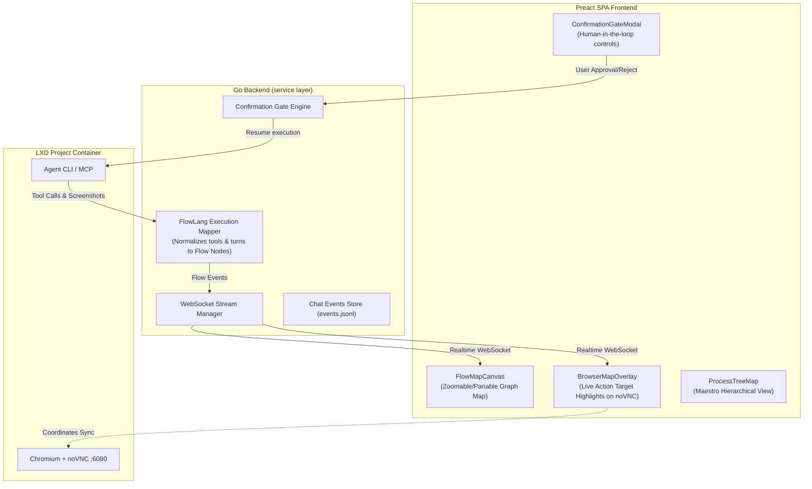

# Implementation Plan: Visual Flow Map for Computer Use (FlowLang Powered)

## Overview & Vision

Currently, `remote.futrx` executes agent turns and computer use actions (via Chromium, noVNC, and `browser_*` MCP tools) using linear chat messages and tool call lists. 

This proposal introduces an interactive **Visual Computer Use Flow Map** powered by **Flow** principles . By treating computer use as a visual **Map of Operations ( Canvas)**, users and agents can view, audit, and steer complex multi-step browser and system tasks as an interactive graph canvas.

---

## Key Flow Concepts Adapted to Remote Computer Use

| FlowLang Concept | Computer Use Map Functionality |
| :--- | :--- |
| **The Conductor (Checkpoints)** | High-level execution phases (e.g. *Initialization* → *DOM Perception* → *Form Input* → *Visual Verification*). Unloads prior context to prevent hallucination. |
| **The Order (Work Unit)** | Atomic computer use actions (`browser_navigate`, `browser_click`, `human-input.sh type`, `browser_take_screenshot`) with state tracking (`created`, `processing`, `completed`, `failed`). |
| **The Maestro (Process Tree)** | A hierarchical map view (with binary path encoding `0`, `01`, `010`) showing how overall task goals break down into sub-tasks and browser execution nodes. |
| **Confirmation Gates (`confirm`)** | Visual pause points requiring human approval before destructive/write actions (e.g. submitting forms, making payments, sending messages). |
| **Causal Data Chains** | Visual edge wires between map nodes showing data handovers (e.g. extracted text from node A passed to input node B). |

---

## Architectural Changes & Component Map

---

## Proposed Changes & File Modifications

### 1. Backend Service Layer (`backend/internal/service/flow/` & `prompt/`)

- **`backend/internal/service/flow/types.go`**:
  Define FlowLang core structures: `FlowNode`, `FlowEdge`, `Checkpoint`, `Order`, `ProcessTreeNode`, and `ConfirmationGateState`.
- **`backend/internal/service/flow/mapper.go`**:
  Transform incoming raw tool events (`browser_navigate`, `browser_click`, `human-input.sh`, `browser_take_screenshot`, `ask_user_question`) into structured FlowLang Checkpoint and Order nodes.
- **`backend/internal/service/prompt/service.go` & RunHub**:
  Emit normalized `flow_node_created`, `flow_node_updated`, `flow_checkpoint_changed`, and `flow_gate_requested` WS events to subscribers.

### 2. Frontend Models & State (`frontend/src/models/flow.ts`, `state/`)

- **`frontend/src/models/flow.ts`**:
  TypeScript definitions for visual flow graph nodes, coordinates, status badges, and action targets.
- **`frontend/src/state/hooks/chat/useFlowMapStore.ts`**:
  State hook to maintain graph nodes, edges, active checkpoint, selection, zoom level, and live execution focus.

### 3. Visual Flow Map UI Components (`frontend/src/ui/chat/flow/`)

- **`FlowMapCanvas.tsx`**:
  Interactive graph canvas featuring:
  - Smooth pan/zoom controls & MiniMap overview.
  - Node status glow effects (Active = Blue pulse, Complete = Emerald glow, Failed = Red glow, Gate = Amber pulse).
  - Node action icons & embedded snapshot thumbnails.
  - Animated edge connectors showing data/execution flow direction.
- **`FlowNodeCard.tsx`**:
  Detailed card rendering for individual checkpoints/orders: action type, duration, target selector/coordinates, and input payload.
- **`ProcessTreeMap.tsx`**:
  Maestro hierarchical tree visualization with binary path badges (`0`, `01`, `011`).
- **`ConfirmationGateModal.tsx`**:
  Visually appealing confirmation panel for human approval of sensitive actions with options to "Approve Action", "Modify Order", or "Abort Task".

### 4. Browser & Computer Use Integration (`frontend/src/ui/chat/browser/`)

- **`BrowserMapOverlay.tsx`**:
  Renders live interactive target markers (click targets, bounding boxes, heatmap points) directly over the noVNC iframe corresponding to the currently selected or executing flow node.
- **`BrowserDrawerHeader.tsx` / Layout**:
  Add view toggle buttons: **[ 💬 Chat ] | [ 🗺️ Computer Use Map ] | [ 🔀 Split Map & Browser ]**.

---

## Phased Implementation Plan

### Phase 1: Backend FlowLang Engine & WS Stream (1-2 days)
1. Implement `backend/internal/service/flow` package.
2. Intercept computer use tool execution events and build real-time FlowLang AST nodes/checkpoints.
3. Broadcast flow events over WebSocket `/ws/chat/{id}`.

### Phase 2: Frontend Visual Map Canvas & Flow Components (2-3 days)
1. Build `FlowMapCanvas.tsx` and custom styling in `index.css` (dark mode glassmorphism, animated flow edges, node status badges).
2. Implement `FlowNodeCard.tsx` and `ProcessTreeMap.tsx` for visual computer-use map rendering.
3. Integrate layout toggle in project chat interface (Chat / Flow Map / Dual View).

### Phase 3: Live Computer Use Overlay & noVNC Sync (1-2 days)
1. Create `BrowserMapOverlay.tsx` to project click coordinates and DOM highlights onto the live noVNC desktop/browser canvas.
2. Synchronize active node highlight on the map with active action in the browser drawer.

### Phase 4: Confirmation Gates & Human Control (1 day)
1. Implement FlowLang `confirm` gates for write/sensitive actions in computer use.
2. Build `ConfirmationGateModal.tsx` with user authorization controls.

---

## Verification & Testing Strategy

1. **Unit & Mapper Tests**:
   - `go test ./backend/internal/service/flow/...` to verify tool call to Flow node mapping and state transitions.
2. **Frontend UI Integration**:
   - Verify layout responsiveness, pan/zoom performance, node rendering, and status updates.
3. **End-to-End QA Workflow (`AGENTS.md` compliant)**:
   - Run `bash infra/qa/deploy-app.sh <ref>` to build and test on QA VM.
   - Execute a multi-step browser task (e.g. navigating to a page, filling a form, taking a screenshot) and verify live flow map rendering and interactive overlays.

---

## Next Steps

Please review this plan and confirm if you would like me to begin Phase 1 (Backend Flow mapper & WS streaming infrastructure)!
