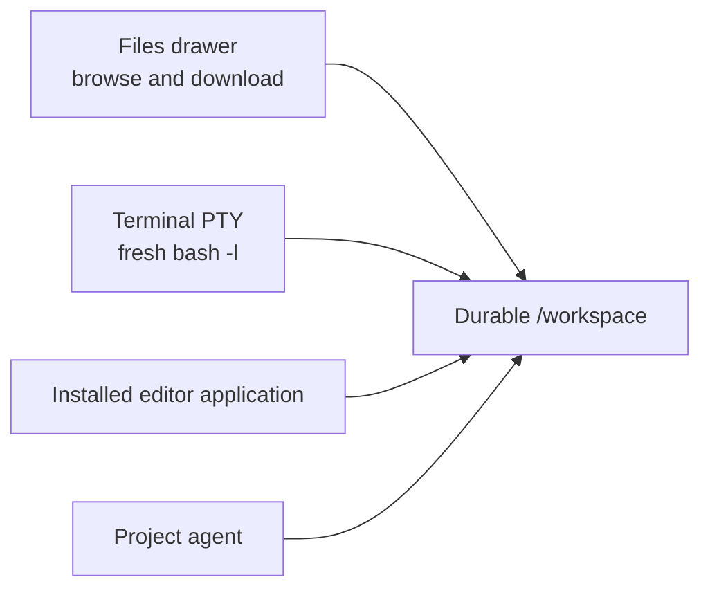

# Files, Terminal, and application editors

Files and Terminal operate on the same project workspace. Installed applications
can add editing actions and file openers to a project chat.


## Before you begin

- Open a chat inside the intended project. These workspace controls are not
  the isolation boundary for a **Loose chat**.
- Confirm the project is one you are allowed to change. Terminal and application
  actions can modify the durable workspace immediately.
- Remember that `/workspace` and the provider homes are durable, while
  arbitrary files elsewhere in the container root filesystem may disappear
  after container replacement.

## Choose the right surface

| Task | Surface | What it changes |
| --- | --- | --- |
| Browse directories, open media/code, or download a file | **Files** | Nothing unless an opened file is edited or a download is saved locally |
| Find a file by name | **Files** | Nothing |
| Download a directory as ZIP | **Files** | Creates a temporary server-side archive, then downloads it |
| Run a command or inspect a process | **Open Terminal** | Whatever the command changes |
| Read and edit a codebase | An installed editor application | Whatever the editor saves |

These tools start from the chat's current working directory. In a normal project
chat that is `/workspace`; a chat working in a contained subdirectory opens
that location where supported.

## Browse and download files

1. Open the project chat.
2. Select **Files** in the chat header.
3. Select a folder row to expand it. Subdirectories load as they are opened.
4. Select a file row to open it in the media viewer or an installed application,
   or to download it as described below.
5. Hover or focus a file and select **Download _filename_** to download
   directly instead.
6. To export a directory, hover or focus it and select **Download _folder_ as
   zip**.
7. Select **Refresh** after an agent or terminal command changes the tree.
8. Select **Close files** when finished.

**Outcome:** supported media opens inside Remote. Code, data, and text files
use a registered application opener when available; otherwise they download.
Folders download as ZIP archives.

### Search by filename

1. Open **Files**.
2. Enter at least two Unicode code points in **Search all files...**.
3. Select a matching file row to open it, or use its download control. Search
   result directories can be downloaded but are not expanded in the flat
   search view.
4. If Remote says **Showing the first matches only — refine your search to
   narrow it down**, add a more specific substring.
5. Select **Clear search** to return to the directory tree.

Search matches path names by substring. It does not search file contents.

### Exact Files limits

| Operation | Current limit |
| --- | --- |
| One directory listing | 10,000 entries |
| Minimum search query | 2 Unicode code points |
| Returned search matches | 300 |
| Entries visited by one search | 200,000 |
| Folder ZIP source data | 1 GiB |
| Folder ZIP compressed spool | 1 GiB |
| Entries in one folder ZIP | 200,000 |
| Folder ZIP jobs | 2 concurrently across the entire Remote server |

A directory can therefore show a truncated warning even when its contents
exist. Search can stop at its visit cap before finding every possible match.
A ZIP fails when either its source-byte, compressed-spool, or entry limit is
reached.

Folder archives omit broken symlinks, symlinks that escape the workspace, and
special files such as sockets or devices. They include regular files and safe
directories.

### What happens when you select a file

| File type | Selection result |
| --- | --- |
| Supported image, audio, video, or PDF | Opens in Remote's full-screen media viewer |
| Code, data, text, log, or unknown non-media file | Uses a registered application file opener, or downloads |
| Archive or unsupported image/audio/video format | Downloads the file |

The media viewer provides **Open in new tab**, **Download**, and **Close**.
Press Escape or select outside the content to close it.

### Open workspace links from chat

Validated absolute workspace links in an agent message follow the same split:
supported media opens in the in-app viewer; other safe files use a running
application's registered file opener or download. A path can include `:line` or
`:line:column`, which the opener receives.

Examples:

```text
/workspace/src/app.ts:42
/workspace/src/app.ts:42:7
```

Current inline media types are:

- images: `.avif`, `.bmp`, `.gif`, `.ico`, `.jpeg`, `.jpg`, `.png`, `.svg`,
  `.tif`, `.tiff`, and `.webp`;
- audio: `.aac`, `.flac`, `.m4a`, `.mp3`, `.oga`, `.ogg`, `.opus`, and `.wav`;
- video: `.m4v`, `.mov`, `.mp4`, `.ogv`, and `.webm`; and
- PDF: `.pdf`.

Path containment is checked server-side; an outside or traversal path is
rejected.

## Run a terminal command

1. Select **Open Terminal** in a project chat.
2. Wait until the header reads **Terminal** and the status becomes
   **Connected**.
3. Check the path shown beside the status before running a command.
4. Run the command in the interactive login shell.
5. Select **Close terminal** when finished.

**Outcome:** Remote starts a fresh `bash -l` through a PTY inside the project
container. The shell begins in the chat working directory when that path maps
into the container, otherwise it falls back to `/workspace`.

On desktop, Terminal opens as a pane beside the chat. Drag its left edge to
resize it; Remote remembers that width in this browser. Opening Files, History,
Schedules, or Browser hides Terminal because workspace panes are mutually
exclusive.

The status can read **Connecting**, **Connected**, **Error**, or **Closed**.
If the project is stopped, opening the terminal first starts it.

> The PTY is intentionally tied to its WebSocket. Hiding and reopening the
> Terminal pane in the same loaded chat preserves its shell and current input.
> Switching chats, losing the socket, reloading, or closing the page kills that
> shell. There is no reconnect after the socket is lost.

Use a process manager or a terminal multiplexer that you configure inside the
project for work that must survive the page. Do not treat the Terminal pane
itself as a durable process supervisor.

## Open an application editor

Install an editor application in the project and use the action it adds to the
chat header. The application controls its own URL and file opening behavior;
Remote checks project membership and that the installation is running before
serving its declared web route. See the application's own guide for its editor
controls and settings.

## How the three paths meet



A change saved by the agent, terminal, or an editor is visible to the other surfaces
after refresh. The surfaces do not create separate copies or per-chat
worktrees.

## Related documentation

- [Projects and containers](../02-workspaces/03-projects-and-containers.md)
- [Workspace tools architecture](../02-workspaces/05-workspace-tools.md)
- [Git history and restore](08-git-history-and-restore.md)
- [Known limitations](../known-limitations.md)
- [Threat model](../threat-model.md)
