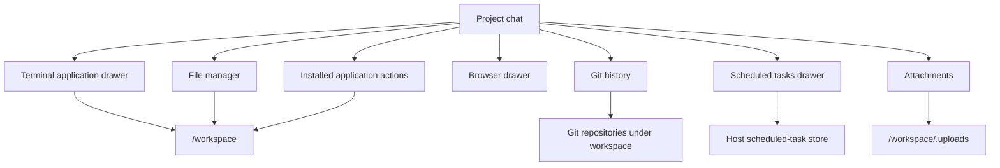
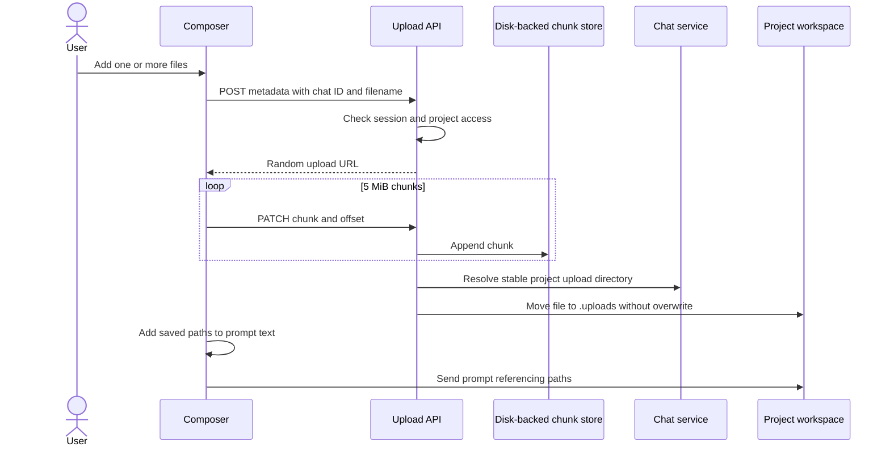
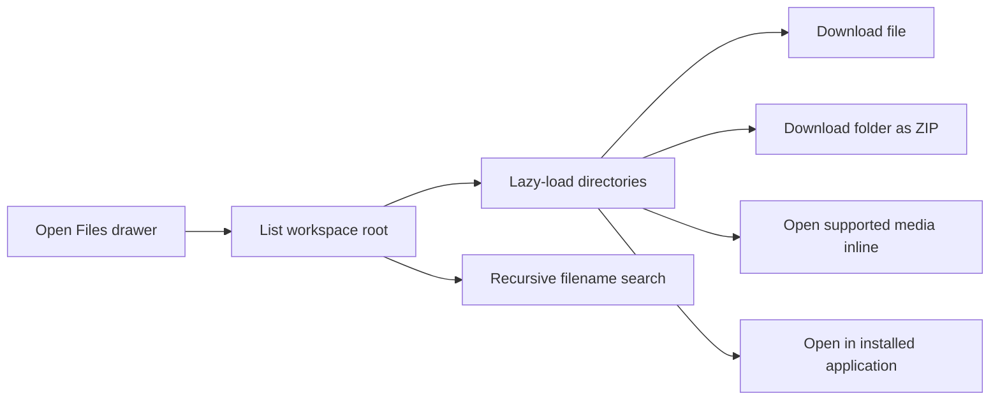
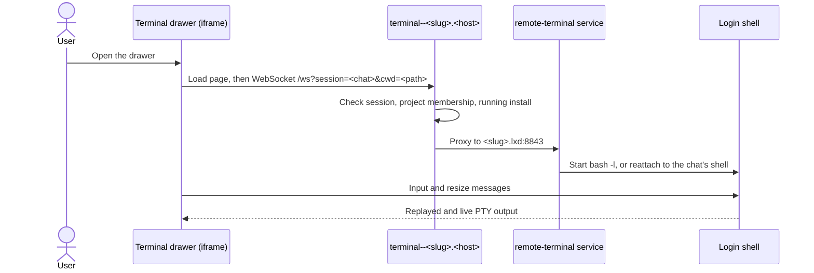
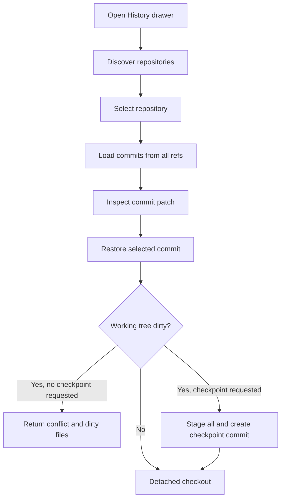

# Workspace tools

The chat header opens Files, Git History, Schedules, Browser, and installed
application actions and drawers, such as the Terminal application's. Most are views over the same project workspace; Schedules is a
host-control-plane view whose runs return to the same chat.

## Tool map

## Attachments

Files can be selected, dragged, or pasted into the composer. Uploads use the resumable tus protocol.

Important behavior:

- Default maximum upload size is 10 GiB and can be changed with `UPLOAD_MAX_BYTES`.
- Chunks live under the application data directory, not RAM-backed `/tmp`.
- Final files are mode `0644` and owned by the container-mapped root user.
- `.uploads/.gitignore` ignores every attachment.
- Existing filenames are not overwritten.

## File manager

The backend resolves all paths relative to the chat working directory and
rejects traversal. Listings and search results can report truncation rather
than returning unbounded data.

Selecting a file routes by type:

- supported image/audio/video/PDF opens in the full-screen media overlay;
- a running project application may register a file opener for text and code;
- when no opener is registered, those files download;
- archives and unsupported media download.

The same routing applies to validated absolute workspace links in chat. File
openers receive optional `:line[:column]` suffixes. Inline media receives a
restrictive content security policy.

## Terminal

The terminal is the installable [Terminal application](../../applications/terminal/README.md),
not a core route. Its shell runs in a service inside the project container, and
the browser reaches that service through the project
[application web route](../dev/installable-applications/19-project-application-web-routes.md).

The drawer exists only for chats attached to a project in which the application
is installed and running. Each chat has one interactive `bash -l`, started in
the chat's directory under `/workspace`. On desktop the drawer is a resizable
pane beside the chat; its width is retained in browser `localStorage`. The
drawer and the Files, History, and Browser panes are mutually exclusive.

The shell belongs to the service, not to the WebSocket. A dropped connection,
a reload, or a restart of Remote leaves it running; the page reconnects while
the drawer is open and the service replays the most recent 256 KiB of output.
A shell with no viewer is ended after 10 minutes, and every shell ends when the
service stops. The gateway does not start a stopped project or installation.

The backend also retains lower-level tmux session APIs and a `/ws` tmux PTY bridge. These are not used by the current main workspace UI, but chats can still carry a `tmuxSession` and resolve their working directory from it.

## Git history

The History drawer discovers Git repositories at the workspace root and up to a bounded depth, excluding heavy or generated directories.

Restore resolves the commit, optionally creates a safety checkpoint using the `remote.futrx` identity, and checks out the target in detached HEAD state. Git commands use an explicit safe directory and bounded timeouts.

The frontend checks for repositories when a ready chat opens and after each
run; **History** stays hidden until at least one exists. Commit patches render
as collapsible per-file cards with line numbers, hunks, change counts, and file
status badges, with raw-text fallback.

The checkout API supports the checkpoint message, but the current History drawer does not render the dirty-tree checkpoint form even though its component state is present. In the visible UI, commit or stash dirty work through Terminal or an installed editor, refresh History, and then switch. Clean-tree switching works directly.

## Scheduled tasks

Install the Scheduled Tasks project application to add its clock action to the
chat header. Ask the agent for future work; tasks are active immediately. The
application UI lists the current chat’s tasks and supports pause, resume, run now,
delete and refresh. Its host backend owns the clock and wakes normal agent turns.
See [Scheduled tasks](06-scheduled-tasks.md).

## Application web routes and workspace links

Project applications can declare a web port in their manifest. Remote exposes a
running installation at `<label>--<project>.<host>` after checking
project access. It selects the upstream port from the validated application
manifest, removes platform cookies before forwarding, and stops routing when
the application stops or is uninstalled. The `/apps/<project-slug>/<application-id>/` launch URL redirects to that origin. The application owns its browser UI,
file URL format, and any chat actions it contributes.

Workspace links in chat are inspected by the frontend. Supported media uses
the authenticated `media-open` route and opens in the in-app viewer. For other
files, an installed application's file opener can supply a URL with optional
line and column. Without one, the file downloads.

## Code map

- Upload handler: [`backend/internal/transport/http/upload_tus.go`](../../backend/internal/transport/http/upload_tus.go)
- Workspace files: [`backend/internal/service/workspacefiles/service.go`](../../backend/internal/service/workspacefiles/service.go)
- Terminal application: [`applications/terminal/`](../../applications/terminal/)
- Extension drawer host: [`frontend/src/ui/chat/extensions/ExtensionDrawer.tsx`](../../frontend/src/ui/chat/extensions/ExtensionDrawer.tsx)
- Git history: [`backend/internal/service/githistory/service.go`](../../backend/internal/service/githistory/service.go)
- Application web routes: [`backend/internal/transport/http/handlers/applications_web_handler.go`](../../backend/internal/transport/http/handlers/applications_web_handler.go)
- Schedules UI: [`applications/scheduled-tasks/ui/`](../../applications/scheduled-tasks/ui/)
