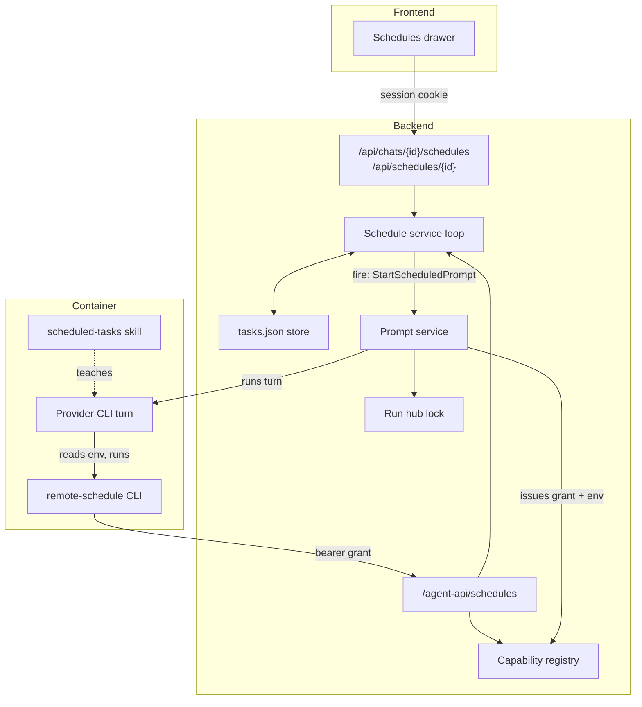

# Scheduled tasks

> **Status: implemented** in `2ffd45f4 feat(schedule): scheduled task runs with per-chat schedule tools`. This document explains the design, every layer of the implementation, the security model, and the known gaps.

A scheduled task binds a **standing prompt** to an existing **project chat** and fires it later — once at a fixed time, or repeatedly on a cron expression. A fire is an ordinary agent turn: it goes through the same prompt service, run lock, event log, and provider CLI as a prompt typed by a user, so it appears in the chat transcript and streams live to any open client.

Both humans and agents can manage schedules:

- **Users** manage them from the Schedules drawer in the chat header (project chats only).
- **Agents** manage them from inside the container with the `remote-schedule` CLI, authorized by a short-lived capability token — never a session cookie.

## Design decisions

The shape of this feature follows four rules:

1. **The backend owns the timer.** Containers stop, get replaced, and cannot start themselves. A cron daemon inside the container would silently die, would race the chat's run lock, and would produce work invisible to the event log. Instead a single scheduler goroutine in the backend claims occurrences and injects prompts.
2. **A fire is a first-class chat run.** The scheduler calls the same `prompt.Service.Start` entry point the chat WebSocket uses. Everything downstream — one-run-per-chat locking, container start, event persistence, broadcast — is inherited rather than reimplemented.
3. **Agent power is a capability, not a credential.** Each agent turn that may touch schedules receives a random bearer token scoped to that owner + chat + project, with a 4-hour TTL, revoked when the turn ends. An unattended (scheduled) turn gets an even narrower scope that can *only* complete its own task.
4. **The tooling is provider-neutral.** The agent-facing surface is a bash CLI plus two environment variables, so Claude, Codex, MiniMax, Kimi, and Antigravity all get the identical power with no per-provider MCP plumbing.

## Component map



## Data model

One task is one JSON object, persisted with all others in a single atomically-replaced document at `<data-dir>/scheduled-tasks/tasks.json` (`version: 1`). Times are Unix milliseconds.

| Group | Fields | Notes |
| --- | --- | --- |
| Identity | `id`, `name`, `ownerEmail`, `projectId`, `chatId` | `id` is 24 hex chars. Owner is the creating user (or the grant's owner when an agent creates it). |
| Definition | `prompt`, `kind` (`once`\|`cron`), `at`, `cron`, `timezone`, `maxRuns`, `overlapPolicy` | Prompt ≤ 32 KiB. Cron is five-field. Timezone must be a canonical IANA name; defaults to `UTC`. `once` forces `maxRuns: 1`. Overlap defaults to `queue_one`. |
| State | `enabled`, `status`, `nextRunAt`, `runCount`, `lastRunAt`, `lastRunFinishedAt`, `lastRunStatus`, `lastError` | `status`: `active`, `running`, `paused`, `completed`, `exhausted`, `error`. |
| Claim | `activeRunId`, `activeRunStartedAt`, `activeRunForced`, `pendingRun`, `pendingRunForced`, `pendingSince`, `retryAt` | Persisted **before** an agent starts, so a process crash is observable and duplicate dispatch is impossible within a running process. |

Run outcomes recorded in `lastRunStatus`: `running`, `succeeded`, `failed`, `skipped`, `queued`, `abandoned`.

## The scheduler loop

A single goroutine (`schedule.Service.loop`) alternates between `RunDue` and sleeping until the earliest deadline. Any mutation (`Create`, `Update`, `Delete`, `RunNow`, a finished run) pokes a buffered wake channel, so the loop never sleeps past a newly created deadline.

Claiming an occurrence (`claim`) is the critical section:

1. Re-read the task; verify it is still enabled, due, and under `maxRuns`.
2. **Chat-level exclusion:** if this task — or any other task on the same chat — holds an active claim, do not dispatch. Consume the occurrence per the overlap policy instead:
   - `queue_one` — set `pendingRun`; any number of missed occurrences coalesce into **one** follow-up that fires as soon as the chat frees up (the finishing run's `notify` wakes the loop).
   - `skip` — record a `skipped` run, consume the occurrence, advance the deadline.
3. Otherwise persist the claim (`activeRunId`, `runCount++`, `status: running`) and advance `nextRunAt` from now (a `once` task's deadline is cleared).

The claim only sees other *scheduled* runs. A prompt the **user** is running in the same chat surfaces one layer down: the executor returns `ErrPromptAlreadyRunning` (from the run hub), which `dispatch` maps back into the same overlap handling — a `queue_one` task is durably re-queued with a 15-second retry (`retryAt`), a `skip` task records a failed run.

Deadline bookkeeping worth knowing:

- A queued (`pendingRun`) occurrence that finally fires while additional cron deadlines have passed **coalesces all of them** — the chat gets one run, not a backlog.
- `RunNow` forces a claim without moving the regular deadline. On a busy chat it becomes one queued follow-up.
- After downtime, an overdue task fires **once** (its stale `nextRunAt` is due), then the next occurrence is computed from now. Missed occurrences are never replayed individually.
- If reads succeed but writes fail (full disk), the loop backs off by the retry interval instead of spinning on the unchanged overdue task.

## Fire path

```mermaid
sequenceDiagram
    participant Loop as Scheduler loop
    participant Repo as tasks.json
    participant Exec as scheduledPromptExecutor
    participant Prompt as Prompt service
    participant Hub as Run hub
    participant CLI as Provider CLI (container)
    participant Chat as Chat event log

    Loop->>Repo: claim occurrence (activeRunId, runCount++)
    Loop->>Exec: StartScheduledPrompt(task, envelope)
    Exec->>Prompt: Start{ChatID, prompt, Actor: owner, ScheduledTaskID, ScheduledRunID}
    Prompt->>Hub: StartRun (one-run-per-chat lock)
    alt chat busy (user prompt running)
        Hub-->>Prompt: refused
        Prompt-->>Exec: ErrPromptAlreadyRunning
        Exec-->>Loop: ErrExecutorBusy → requeue or skip
    else accepted
        Prompt->>Caps: issue complete-self grant
        Prompt->>Chat: persist user event (the envelope)
        Prompt->>CLI: run turn (container started if needed,<br>REMOTE_SCHEDULE_API/GRANT in env)
        CLI-->>Chat: normalized agent events
        CLI-->>Prompt: exit
        Prompt-->>Exec: RunResult{Output: concatenated assistant text}
        Exec-->>Loop: done channel
        Loop->>Repo: finish() — clear claim, record outcome
    end
```

The executor bridge lives in [`services.go`](../../backend/internal/service/services.go): it maps `prompt.ErrPromptAlreadyRunning` to `schedule.ErrExecutorBusy` and forwards the run's completion channel. The prompt service accumulates every `assistant_text` event into `RunResult.Output` so the scheduler can inspect the turn's final text.

### The prompt envelope

The backend wraps the stored prompt before injection (`ScheduledPrompt` in [`service.go`](../../backend/internal/service/schedule/service.go)):

```text
[scheduled task "watch deploy", fire 3/12]

<stored prompt>

Continue the standing task from earlier in this chat. If the standing goal
is complete, end your response with exactly:
SCHEDULE_STATUS=COMPLETE

Otherwise, report the current status and what remains. The backend will
manage this schedule.
```

### Completion

A recurring task stops in three ways, in order of robustness:

1. **`remote-schedule complete-current`** — the agent calls the scoped completion endpoint mid-turn. This is claim-checked: the grant's run ID must match the task's `activeRunId`, so one scheduled run can never complete a different task.
2. **The marker** — if the last non-empty line of the turn's assistant text is exactly `SCHEDULE_STATUS=COMPLETE` (or legacy `TASK_COMPLETE`), `finish()` disables the task as completed.
3. **Bounds** — `maxRuns` exhaustion, or a `once` task simply finishing.

`finish()` also preserves an explicit completion decision made mid-run even if the turn later errors, leaves paused/completed state untouched after a forced `RunNow`, and marks a `once` task `error` when its single run failed.

### Crash recovery

`Start()` runs `recoverClaims` before the loop: any task still holding an `activeRunId` from a previous process is marked `abandoned` ("scheduler stopped before the run reported completion") and returned to a sane status — `active` if recurring and enabled, `error` for an interrupted `once`, `exhausted` if the bounds were hit. Nothing is silently re-fired.

## The agent power

### Opt-in gating

Schedule tools are **off by default**. The prompt service enables them (`EnableScheduleTools`) only when:

- the user has selected the **Scheduled Tasks** skill for the chat, or
- the turn *is* a scheduled fire (`ScheduledTaskID` set) — in which case the skill reference is force-appended so the SKILL.md guidance is loaded.

Loose chats are rejected outright: scheduled tasks require a project chat.

### Capability grants

When enabled, the prompt service asks the in-memory capability registry ([`registry.go`](../../backend/internal/service/schedulecapability/registry.go)) for a grant and injects two variables into the provider CLI's environment for that one turn:

| Variable | Value |
| --- | --- |
| `REMOTE_SCHEDULE_API` | `<base-url>/agent-api/schedules` |
| `REMOTE_SCHEDULE_GRANT` | 32 random bytes, base64url — the bearer token |

Grant properties:

- Bound to owner email, chat ID, project ID (and, for scheduled fires, task + run ID).
- **Scope `manage`** for interactive turns where the user selected the skill: create (disabled, pending user arm), list, pause, run-now, delete — always fenced to the grant's own chat/owner/project. Enabling (arming/resuming) is reserved for users.
- **Scope `complete-self`** for scheduled fires: the *only* permitted call is `POST /agent-api/schedules/current/complete`. An unattended run can never mint, modify, or list schedules. This is the anti-runaway property: a compromised or confused scheduled turn cannot reproduce itself.
- 4-hour TTL, revoked (best-effort) when the turn ends; the registry is in-memory, so a backend restart invalidates all outstanding grants.

### Container tooling

The scheduletools adapter ([`adapter.go`](../../backend/internal/integration/containers/scheduletools/adapter.go)) publishes two assets into every project container — at container launch and re-verified (sha256) before any schedule-enabled turn:

- `/workspace/scripts/remote-schedule` — a curl+jq wrapper over the agent API (`create`, `list`, `pause`, `resume`, `run-now`, `delete`, `complete-current`).
- `/workspace/.agents/skills/scheduled-tasks/SKILL.md` — the playbook: only schedule on explicit user request, write self-contained durable prompts (goal, per-fire actions, observable completion condition, safety constraints), prefer `--max-runs` for monitoring, prefer pause over delete, and never guess that a standing goal is complete.

Both live under `/workspace`, so they survive container replacement. Shared
project preparation ensures these assets for an enabled run, and the common
container-command builder passes the runtime environment. A future module that
declares scheduled-tool support must use that preparation contract and forward
the runtime environment; the descriptor alone does not grant the CLI access to
those tools.

## HTTP surface

| Route | Auth | Methods | Notes |
| --- | --- | --- | --- |
| `/api/chats/{id}/schedules` | session | GET, POST | Delegated from the chat handler after chat access is authorized; list is filtered to the chat. |
| `/api/schedules/{id}` | session | PATCH, DELETE | PATCH accepts the full definition — `name`, `prompt`, `kind`, `at`, `cron`, `timezone`, `maxRuns`, `overlapPolicy` — plus `enabled`; changed schedules revalidate and recompute their deadline. |
| `/api/schedules/{id}/run` | session | POST | RunNow. |
| `/agent-api/schedules` | bearer grant (`manage`) | GET, POST | Chat/project forced from the grant, never from the body. Created tasks start **disabled** (the arm step). |
| `/agent-api/schedules/{id}` | bearer grant (`manage`) | PATCH, DELETE | Target must match the grant. PATCH is pause-only: `{"enabled": true}` is refused (403) — arming is reserved for users, and definition edits from an agent would bypass a user's arm decision. |
| `/agent-api/schedules/{id}/run` | bearer grant (`manage`) | POST | |
| `/agent-api/schedules/current/complete` | bearer grant (`complete-self`) | POST | Claim-checked against the live run ID. |

Request bodies are capped at 64 KiB with unknown fields rejected. `at` accepts Unix milliseconds or RFC3339. Service errors map onto 400/403/404/409 in [`schedule_handler.go`](../../backend/internal/transport/http/handlers/schedule_handler.go); a busy chat surfaces as 409.

## Authorization lifecycle

Creation validates that the chat exists, belongs to a project, matches the claimed project, and that the owner is registered with access to that project. The same checks re-run **at every fire**: a task whose chat was deleted, whose project no longer matches, or whose owner was deregistered or lost project access is paused with `status: error` rather than retried forever. Transient lookup failures defer with `retryAt` instead of pausing. Admin owners bypass the per-project membership check, consistent with the rest of the platform.

## Cron semantics

[`cron.go`](../../backend/internal/service/schedule/cron.go) implements traditional five-field cron (`minute hour day-of-month month day-of-week`) with lists, ranges, and steps; `0` and `7` both mean Sunday; no seconds field. `Next` walks minute-by-minute in the task's IANA timezone (bounded at eight years, which covers every leap-day arrangement), so DST transitions behave like classic cron. Every task stores an explicit timezone; the SKILL.md forbids relying on the container's local time.

## Frontend

The chat header shows a Schedules control for project chats, opening the drawer ([`ScheduleDrawer.tsx`](../../frontend/src/ui/chat/schedules/ScheduleDrawer.tsx)). The current creation path is conversational: select the Scheduled Tasks skill and ask the agent to create the task. The drawer lists tasks with status, next/last run, owner, and last error, and lets the user arm, pause/resume, edit, run now, refresh, or delete them over [`chatScheduleApi.ts`](../../frontend/src/api/chat/chatScheduleApi.ts).

## Configuration

Deployment guardrails, all env-configured with conservative defaults; an explicit `0` disables a limit:

| Variable | Default | Meaning |
| --- | --- | --- |
| `SCHEDULE_MIN_INTERVAL` | `5m` | Floor between two starts of one cron task. Enforced twice: create/update validation samples successive occurrences and rejects expressions that fire faster, and the claim path defers any occurrence arriving sooner than `lastRunAt + floor` (delayed, not consumed). Forced Run now bypasses the floor. |
| `SCHEDULE_MAX_CONCURRENT` | `2` | Cap on simultaneous scheduled runs across all chats — bounds how many containers unattended fires can boot at once. Saturated occurrences follow the task's overlap policy (queue or skip) and queued tasks fire as slots free up. Forced runs bypass the cap but count toward it. |
| `SCHEDULE_MAX_TASKS_PER_PROJECT` | `20` | Cap on standing task definitions per project. Terminal tasks (completed, exhausted, error) are history and do not consume quota. |

## Guardrails in place

- Per-chat opt-in (skill selection) before any interactive turn can manage schedules.
- Scheduled turns are `complete-self` only — no self-replication.
- **Agent-created tasks start disabled** and must be armed by a user in the drawer; the agent API cannot enable a task, and agent PATCH cannot edit definitions.
- Grant fencing to owner + chat + project on every agent-API call.
- One run per chat, enforced twice (claim layer and run-hub lock); overlaps coalesce or skip, never stack.
- **Minimum recurrence interval** with fire-time enforcement, a **global concurrent-run cap**, and a **per-project task quota** (see Configuration).
- Fire-time re-authorization of owner and project access; permanent failures pause the task.
- `maxRuns` bounds, 32 KiB prompt cap, 64 KiB request cap, durable claims, atomic persistence.

## Known gaps

Ranked by how much they matter operationally:

1. **Session growth.** Every fire resumes the same provider session; a long-lived cron task accretes context and token cost. `--max-runs` is the current mitigation; session compaction or fresh-session-per-fire with injected summary would be the structural fix.
2. **Marker sniffing is a fallback.** Completion detection via the last output line depends on the provider's final text surviving normalization verbatim; `complete-current` is the robust path and the skill teaches it first.
3. **Interval validation is sampled.** Create-time validation samples 32 successive occurrences over a 45-day horizon, so a cron whose tight pairs are rarer than that can pass validation — the fire-time deferral in the claim path is what makes the floor airtight.

## Code map

- Scheduler service, claim/overlap/finish state machine: [`backend/internal/service/schedule/service.go`](../../backend/internal/service/schedule/service.go)
- Task model and persistence shape: [`backend/internal/service/schedule/model.go`](../../backend/internal/service/schedule/model.go)
- Cron parser: [`backend/internal/service/schedule/cron.go`](../../backend/internal/service/schedule/cron.go)
- Capability registry (grants, scopes, TTL): [`backend/internal/service/schedulecapability/registry.go`](../../backend/internal/service/schedulecapability/registry.go)
- Executor bridge and service wiring: [`backend/internal/service/services.go`](../../backend/internal/service/services.go)
- Prompt-side gating, grant issuance, env injection: [`backend/internal/service/prompt/service.go`](../../backend/internal/service/prompt/service.go)
- HTTP handler (user + agent APIs): [`backend/internal/transport/http/handlers/schedule_handler.go`](../../backend/internal/transport/http/handlers/schedule_handler.go)
- Container assets (CLI + skill) and publisher: [`backend/internal/integration/containers/scheduletools/`](../../backend/internal/integration/containers/scheduletools/)
- JSON store: [`backend/internal/stores/fileschedule/store.go`](../../backend/internal/stores/fileschedule/store.go)
- Frontend drawer and API: [`frontend/src/ui/chat/schedules/`](../../frontend/src/ui/chat/schedules/), [`frontend/src/api/chat/chatScheduleApi.ts`](../../frontend/src/api/chat/chatScheduleApi.ts)
