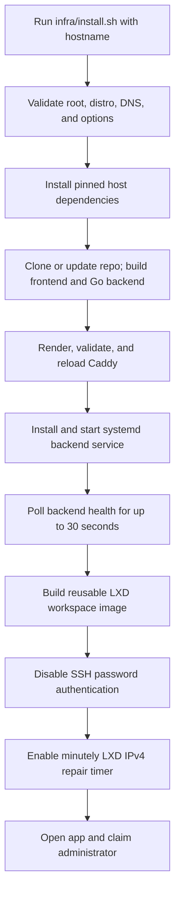
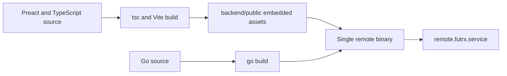
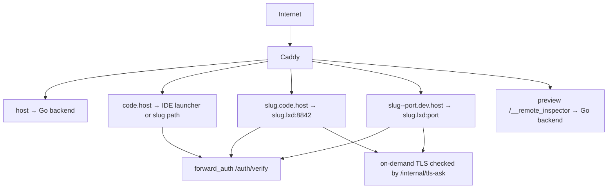
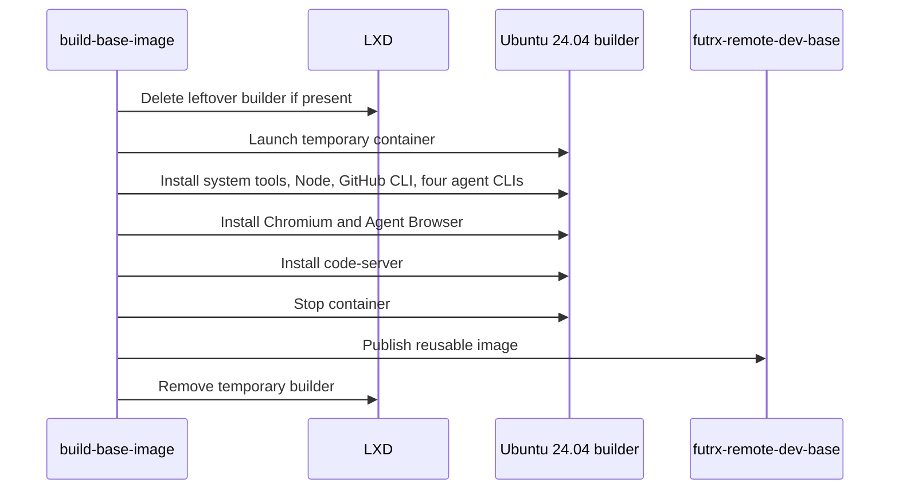
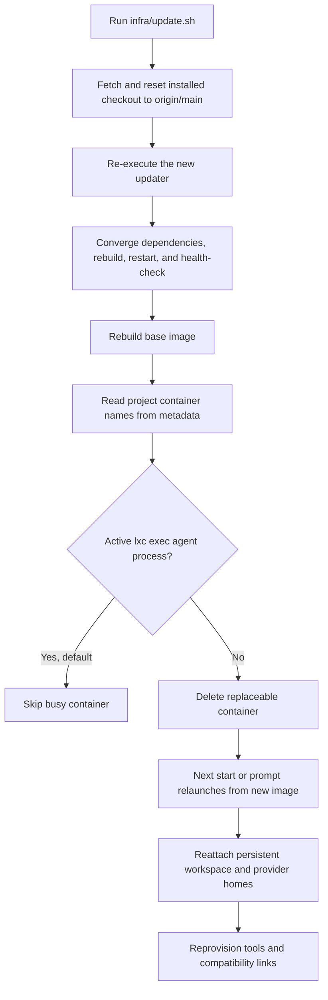
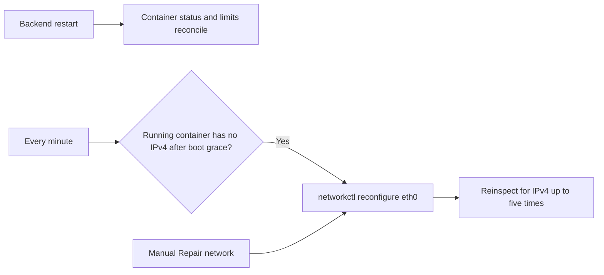

# Deployment and operations

The supported deployment is a root-managed Ubuntu or Debian server with DNS pointing to the host, ports 80 and 443 open, and working SSH key access.

## Installation flow



The curl bootstrap installs Git if needed, clones into `/opt/remote.futrx`, and re-executes the checked-out installer.

## Installed components

| Component | Purpose |
| --- | --- |
| `/opt/remote.futrx` | Application checkout, built binary, frontend assets, infrastructure scripts, and data |
| `remote.futrx.service` | Go backend on loopback port `7682` by default |
| Caddy | Public HTTPS, compression, authentication, and proxy routing |
| LXD | Project-container runtime and base-image store |
| `futrx-remote-dev-base` | Reusable Ubuntu workspace image |
| `.lxd` DNS integration | Resolves container names through the LXD bridge |
| `lxc-ipv4-heal.timer` | Repairs running containers that lose IPv4 |
| code-server launcher PWA | One installable entry point for project IDEs |

## Build flow



The backend embeds the compiled frontend, so Caddy only needs to proxy the main origin to the Go process.

## Public routing



Caddy validates its rendered configuration before replacing the live file. On-demand certificate requests are accepted only for existing project slugs and permitted hostname formats.

## Base-image build



The recipe is generated from the same provider profiles used by runtime CLI repair, keeping agent package versions consistent.

## Update flow



`--include-busy` forces busy workspace recycling. `--skip-workspaces` updates only the host and application. `upgrade-workspaces.sh --dry-run` shows the workspace plan without changing it.

The intended default is to skip active agent containers. The current busy-process matcher expects a different `lxc exec` argument order than the provider commands use, so it may classify an active run as idle. Until that detector is corrected, treat workspace recycling as disruptive: coordinate a maintenance window or use `--skip-workspaces` while runs are active.

The updater intentionally resets the installed application checkout to `origin/main`. Persistent application data and project workspaces live outside the tracked source tree.

## Startup reconciliation

When the backend starts, it:

1. loads file stores and in-memory indexes;
2. builds the agent and container service graph;
3. compares project metadata with LXD state;
4. updates stored project status;
5. reapplies the fleet resource profile and project overrides;
6. starts the Agent Browser idle reaper;
7. starts the scheduled-task loop and restores persisted deadlines/claims;
8. begins serving the embedded SPA, API, and WebSockets.

## Scheduled-task guardrails

Scheduled tasks are host-owned unattended runs, so the backend applies three
independent limits:

| Environment variable | Default | Meaning |
| --- | ---: | --- |
| `SCHEDULE_MIN_INTERVAL` | `5m` | Minimum time between starts of one recurring task; Go duration syntax |
| `SCHEDULE_MAX_CONCURRENT` | `2` | Simultaneous scheduled runs across all chats |
| `SCHEDULE_MAX_TASKS_PER_PROJECT` | `20` | Non-terminal standing tasks in one project |

An explicit `0` disables a limit. **Run now** bypasses the interval and
concurrency admission limits, but the forced run still counts while active.
Terminal completed/exhausted/error definitions do not consume the
per-project task quota.

Create a systemd override rather than editing the installed unit template:

```bash
sudo systemctl edit remote.futrx
```

```ini
[Service]
Environment=SCHEDULE_MIN_INTERVAL=10m
Environment=SCHEDULE_MAX_CONCURRENT=1
Environment=SCHEDULE_MAX_TASKS_PER_PROJECT=10
```

Then apply it:

```bash
sudo systemctl daemon-reload
sudo systemctl restart remote.futrx
```

## Audit-log retention

The backend keeps an append-only audit trail under `DATA_DIR/audit/`, one JSONL
file per calendar month. A janitor goroutine runs at startup and every 24 hours
and deletes whole monthly files that fall outside the retention window.

| Environment variable | Default | Meaning |
| --- | ---: | --- |
| `AUDIT_RETENTION_MONTHS` | `12` | Monthly audit files to keep, including the current one; `0` disables pruning and keeps every file |

Retention deletes files rather than truncating them, so export or copy them
before shortening the window. See [Audit log](10-audit-log.md) for the entry
format, the action names, and the admin API.

Restarting the backend interrupts control of interactive and scheduled runs.
Use a maintenance window. Before raising the limits, account for the fact that
each scheduled occurrence can start a project container and consume provider
quota, CPU, memory, network, and disk without an open browser.

## Health and recovery



The server-info settings page reports host, CPU, memory, storage, network, and Go-process metrics. The project page reports the corresponding per-container diagnostics.

## Security controls

- The backend listens on loopback by default; Caddy is the public entry point.
- Platform sessions use secure, HTTP-only cookies.
- Preview and IDE requests use forward authentication; preview authorization is project-aware, while IDE authorization currently accepts any registered user.
- Platform cookies are removed before container proxying.
- Internal Caddy helper routes are denied externally.
- Secret, auth, access, audit, and user files use restrictive permissions.
- SSH password and keyboard-interactive authentication are disabled after install.
- On-demand TLS issuance is restricted to valid, existing project hosts.
- Project containers are unprivileged and receive host workspaces through mapped ownership.
- Project containers currently share the LXD bridge without lateral ACLs; code-server and noVNC rely on Caddy for public authentication and do not independently authenticate direct bridge traffic.

## Operational commands

```bash
systemctl status remote.futrx
systemctl status caddy
journalctl -u remote.futrx -f
sudo bash /opt/remote.futrx/infra/update.sh
sudo bash /opt/remote.futrx/infra/upgrade-workspaces.sh --dry-run
```

## Code map

- Installer: [`infra/install.sh`](../../infra/install.sh)
- Updater: [`infra/update.sh`](../../infra/update.sh)
- Workspace upgrade: [`infra/upgrade-workspaces.sh`](../../infra/upgrade-workspaces.sh)
- Systemd template: [`infra/templates/remote.futrx.service.tmpl`](../../infra/templates/remote.futrx.service.tmpl)
- Base-image builder: [`backend/internal/service/container/image/builder.go`](../../backend/internal/service/container/image/builder.go)
- Audit store: [`backend/internal/stores/fileaudit/store.go`](../../backend/internal/stores/fileaudit/store.go)
