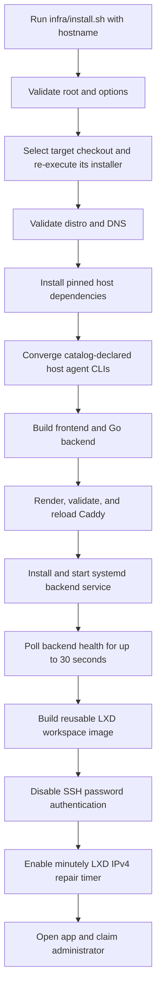
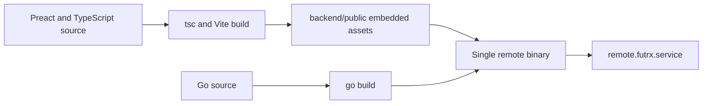
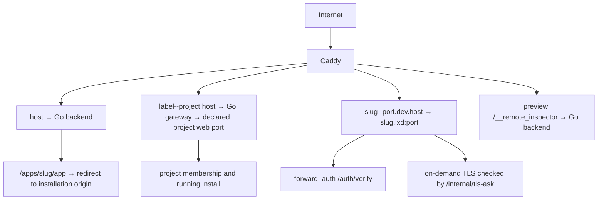
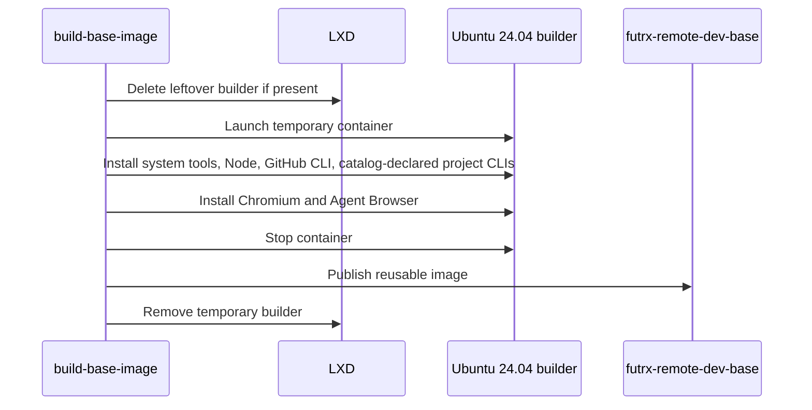
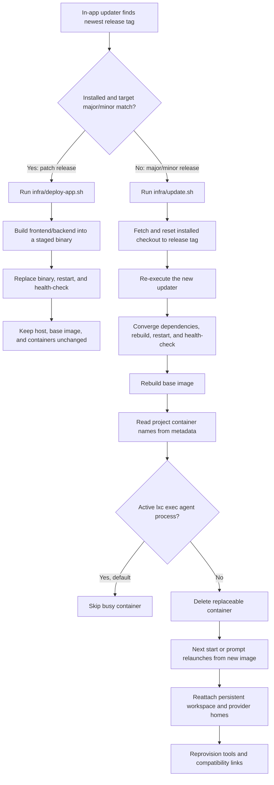
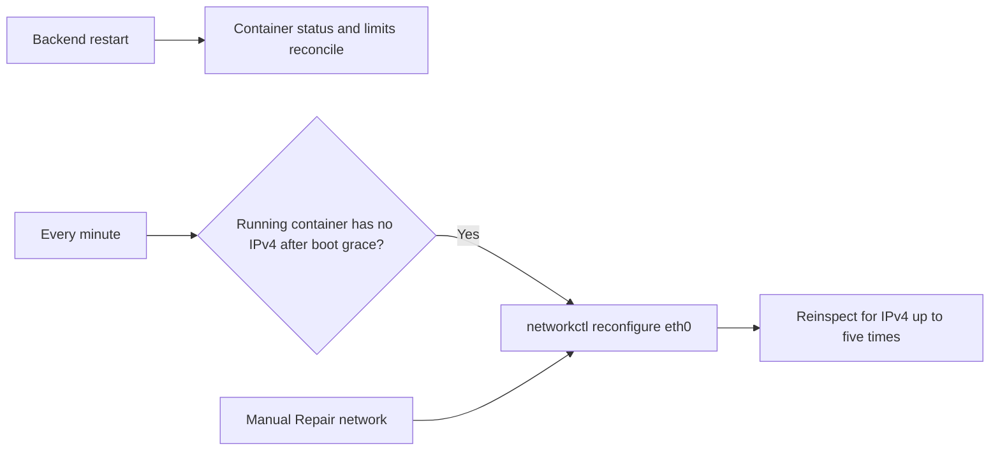

# Deployment and operations

The supported deployment is a root-managed Ubuntu or Debian server with DNS pointing to the host, ports 80 and 443 open, and working SSH key access.

## Installation flow


```mermaid
flowchart TD
    Start["Run infra/install.sh with hostname"] --> Root["Validate root and options"]
    Root --> Checkout["Select target checkout and re-execute its installer"]
    Checkout --> Validate["Validate distro and DNS"]
    Validate --> Deps["Install pinned host dependencies"]
    Deps --> Agents["Converge catalog-declared host agent CLIs"]
    Agents --> Build["Build frontend and Go backend"]
    Build --> Proxy["Render, validate, and reload Caddy"]
    Proxy --> Service["Install and start systemd backend service"]
    Service --> Health["Poll backend health for up to 30 seconds"]
    Health --> Image["Build reusable LXD workspace image"]
    Image --> SSH["Disable SSH password authentication"]
    SSH --> Heal["Enable minutely LXD IPv4 repair timer"]
    Heal --> Ready["Open app and claim administrator"]
```

The curl bootstrap installs Git if needed, clones into `/opt/remote.futrx`, and
re-executes the checked-out installer. Direct repair runs follow the same
select-and-re-execute rule before reading version pins or the agent catalog, so
one convergence cannot mix policy from two commits.

## Installed components

| Component | Purpose |
| --- | --- |
| `/opt/remote.futrx` | Application checkout, built binary, frontend assets, infrastructure scripts, and data |
| `remote.futrx.service` | Go backend on loopback port `7682` by default |
| Caddy | Public HTTPS, compression, authentication, and proxy routing |
| LXD | Project-container runtime and base-image store |
| Catalog-declared host agent CLIs | Local binaries for host-scoped execution and managed authentication |
| `futrx-remote-dev-base` | Reusable Ubuntu workspace image |
| `.lxd` DNS integration | Resolves container names through the LXD bridge |
| Container API DNS pin | Resolves the installation's public hostname to the LXD gateway for container-to-host HTTPS |
| `lxc-ipv4-heal.timer` | Repairs running containers that lose IPv4 |
| Main application PWA | Installable chat/control surface, Web Push, and a network-failure offline page |

## Package repository failures

Host package refreshes use APT's strict error mode: unavailable required
repositories and signature verification errors stop installation or updates.

If Caddy is already usable and its stable Cloudsmith repository returns
HTTP 402, the updater retries with temporary copies of the APT source files
that omit only that repository. Ubuntu/Debian, NodeSource, and custom sources
retain their signature settings and must refresh successfully. The updater
logs the recovery; it does not edit the host's source files or disable APT
signature verification. Genuine Caddy signature errors do not qualify for
this recovery. The same behavior applies to NodeSource's setup refreshes.

Fresh installations download the official Caddy Debian package from its
latest stable GitHub release, check its published SHA-512 checksum and package
metadata, then install it through APT. They do not add a Cloudsmith source.
Existing Caddy binaries and administrator-managed package sources are kept.

Regression tests: `bash infra/tests/host-apt-test.sh` and
`bash infra/tests/caddy-package-test.sh`. Validate the full updater on QA with
the failing repository still configured; manually disabling it does not test
the production recovery path.

## Build flow


```mermaid
flowchart LR
    Frontend["Preact and TypeScript source"] --> Vite["tsc and Vite build"]
    Vite --> Public["backend/public embedded assets"]
    GoSource["Go source"] --> GoBuild["go build"]
    Public --> Binary["Single remote binary"]
    GoBuild --> Binary
    Binary --> Systemd["remote.futrx.service"]
```

The backend embeds the compiled frontend, so Caddy only needs to proxy the main origin to the Go process.

The Vite build stamps the bundle with a fingerprint of its `index.html`. That
file names every content-hashed script and stylesheet, so the fingerprint
changes only when the frontend itself changes. The stamp goes into the page as
`<meta name="remote-build">` and is also served as `/build.json`, which is
never cached. An open page compares the two and reloads itself after a deploy
replaces its frontend. See [Frontend build after a deploy](#frontend-build-after-a-deploy).

## Host agent CLI convergence

After the host toolchain is available and the target checkout is selected, the
application step builds the explicit compiled-in agent module catalog and runs
`backend/cmd/install-host-agents`, which selects profiles for modules declaring
the `host` execution scope. A host-scoped local CLI module supplies a profile;
a host-only remote integration may omit one and requires no local install.
Each profile originates from the provider's local `NewFactory()`/`Profile()`;
the installer applies the catalog without provider-specific branches.

For each selected profile, the installer runs the provider-declared version
arguments against its application-managed executable under
`/opt/remote.futrx/data/host-clis/bin` and compares the detected semver with the
exact pin (or checks binary existence when version checks are disabled). npm
and standalone-script installers target the same managed prefix. The installer
and backend service put that directory first on `PATH`, and convergence rejects
any state where ordinary command resolution selects a different executable.
The global
`config.AgentOptions.HostCLIVersionTimeout` currently caps each host version
command at 15 seconds. The installer
installs stale/missing npm CLIs at the exact package pin or runs the profile's
pinned install script, then applies the profile's post-install verification
policy with a fresh version-probe budget from that same global setting. The
provider-declared profile timeout bounds only the mutating install command.
Providers are converged sequentially because they share the managed prefix.
Each install runs in an
isolated process group; cancellation terminates its descendants before the
updater returns. Any provider-scoped install or verification error aborts the
infrastructure step. Preview the derived plan without changing the host:

```bash
cd /opt/remote.futrx/backend
go run ./cmd/install-host-agents --plan
```

The same profile CLI policy is consumed by the project base-image and runtime
repair paths, preventing a second provider list from drifting away from host
execution. A CLI pin or module-profile change therefore requires the full
infrastructure update; the application-only deployer does not rerun host
convergence or rebuild project images.

## Public routing


```mermaid
flowchart TD
    Internet["Internet"] --> Caddy
    Caddy --> Main["host → Go backend"]
    Main --> Launch["/apps/slug/app → redirect to installation origin"]
    Caddy --> AppWeb["label--project.host → Go gateway → declared project web port"]
    Caddy --> Preview["slug--port.dev.host → slug.lxd:port"]
    Caddy --> Inspector["preview /__remote_inspector → Go backend"]

    Preview --> Auth["forward_auth /auth/verify"]
    AppWeb --> Membership["project membership and running install"]
    Preview --> TLS["on-demand TLS checked by /internal/tls-ask"]
```

Caddy validates its rendered configuration before replacing the live file. On-demand certificate requests are accepted only for existing project previews and running web installations with permitted hostname formats. Configure `*.<host>` DNS for installed applications.

## Container-to-host API DNS

Application tools in project containers call the public installation origin at
`https://<hostname>/agent-api/applications`. If the host's `/etc/hosts` maps that
hostname to `127.0.1.1`, the bridge's dnsmasq can expose the loopback answer to
containers. A container then connects to itself instead of the host API.

During host dependency convergence, `infra/steps/01-host-deps.sh` installs
`dnsutils` for `dig`, detects the `lxdbr0` IPv4 gateway, and invokes
`infra/lib/container-api-dns.sh`. The helper preserves custom `raw.dnsmasq`
settings outside its marked block and writes:

```text
# BEGIN remote.futrx container API DNS
no-hosts
host-record=<installation hostname>,<bridge gateway IPv4>
# END remote.futrx container API DNS
```

`no-hosts` prevents the bridge DNS from importing the host's `/etc/hosts`.
Other host aliases from that file therefore stop being exposed to containers;
LXD container/DHCP records and explicit custom DNS records remain available.
The exact-hostname pin avoids public-IP hairpin routing. The HTTPS URL and
certificate hostname remain unchanged: traffic reaches Caddy through the
gateway with normal TLS verification.

The helper validates its inputs and ownership markers, replaces an old managed
block when the hostname or gateway changes, and skips configuration writes
when the desired block is already present. It queries the bridge resolver for
both A and AAAA records, requiring only the gateway IPv4 and no IPv6 answer.
Verification has up to five attempts. If it fails after a configuration change,
the helper attempts to restore the previous configuration and reports failure;
the installer stops host convergence. A failed rollback is also reported.

Fresh installs and full infrastructure updates apply this configuration.
`update.sh` already invokes `install.sh`, including with `--skip-workspaces`.
`--skip-dns-check` skips public DNS validation, not this bridge DNS check.
Application-only deployments do not apply it. The managed configuration is
stored in LXD; no per-container hosts entry is needed. Containers configured
to bypass the bridge resolver are outside this mechanism.

### Verify resolution and HTTPS

On the host, set the actual installation hostname and an existing disposable
project container name:

```bash
API_HOST=remote.example.com
TEST_CONTAINER=your-test-project-container
BRIDGE=lxdbr0
GATEWAY=$(sudo lxc network get "$BRIDGE" ipv4.address)
GATEWAY=${GATEWAY%/*}

dig @"$GATEWAY" "$API_HOST" A +short
dig @"$GATEWAY" "$API_HOST" AAAA +short
sudo lxc exec "$TEST_CONTAINER" -- getent ahostsv4 "$API_HOST"
sudo lxc exec "$TEST_CONTAINER" -- \
  curl --noproxy '*' --connect-timeout 5 --max-time 15 \
  -sS -o /dev/null -w 'peer=%{remote_ip} status=%{http_code}\n' \
  "https://$API_HOST/"
```

Expect the gateway IPv4 from the A lookup and container resolution, no AAAA
answer, and a successful HTTPS connection without disabling certificate
verification. Retry an application tool from a new agent turn to verify its
authenticated API call; do not print or share `REMOTE_APPLICATION_GRANT`.

For regression testing on a disposable QA host, back up `/etc/hosts` and the
bridge's `raw.dnsmasq` before injecting a loopback mapping for the actual API
hostname. Before applying the pin, reload bridge DNS and confirm loopback
resolution and a refused container HTTPS connection. Apply the helper while
leaving the bad hosts entry present, then repeat the checks above. Restore the
host's original hosts file after testing. Test both fresh installation and
full update paths separately; copying and invoking the helper alone does not
verify installer integration.

The hermetic regression suite is `bash infra/tests/container-api-dns-test.sh`,
also run by CI. It covers configuration preservation, repeat runs, replacing
an old pin, invalid input, configuration errors, wrong DNS answers, rollback,
and both updater modes. Its LXD and DNS commands are simulated; a real host
test is still required to verify network reloads and container HTTPS.

## Base-image build


```mermaid
sequenceDiagram
    participant Builder as build-base-image
    participant LXD
    participant Ubuntu as Ubuntu 24.04 builder
    participant Alias as futrx-remote-dev-base

    Builder->>LXD: Delete leftover builder if present
    Builder->>Ubuntu: Launch temporary container
    Builder->>Ubuntu: Install system tools, Node, GitHub CLI, catalog-declared project CLIs
    Builder->>Ubuntu: Install Chromium and Agent Browser
    Builder->>Ubuntu: Stop container
    Builder->>Alias: Publish reusable image
    Builder->>LXD: Remove temporary builder
```

The recipe is generated from the project-scoped module profiles used by
runtime CLI repair. Host convergence uses the host-scoped subset of the same
catalog, keeping provider packages and pins consistent across execution
environments.

## Update flow


```mermaid
flowchart TD
    Check["In-app updater finds newest release tag"] --> Line{"Installed and target major/minor match?"}
    Line -->|"Yes: patch release"| App["Run infra/deploy-app.sh"]
    App --> AppBuild["Build frontend/backend into a staged binary"]
    AppBuild --> AppRestart["Replace binary, restart, and health-check"]
    AppRestart --> AppDone["Keep host, base image, and containers unchanged"]
    Line -->|"No: major/minor release"| Update["Run infra/update.sh"]
    Update --> Pull["Fetch and reset installed checkout to release tag"]
    Pull --> Reexec["Re-execute the new updater"]
    Reexec --> Install["Converge dependencies, rebuild, restart, and health-check"]
    Install --> Rebuild["Rebuild base image"]
    Rebuild --> Scan["Read project container names from metadata"]
    Scan --> Busy{"Active lxc exec agent process?"}
    Busy -->|"Yes, default"| Skip["Skip busy container"]
    Busy -->|"No"| Delete["Delete replaceable container"]
    Delete --> Relaunch["Next start or prompt relaunches from new image"]
    Relaunch --> Mount["Reattach persistent workspace and provider homes"]
    Mount --> Provision["Reprovision tools and compatibility links"]
```

Release tags use `MAJOR.MINOR.PATCH`. Crossing a major or minor boundary runs
the full infrastructure updater; movement within one major/minor line runs the
application-only deployer. The decision is relative to the installed version:

| Upgrade | Deployment path |
| --- | --- |
| `0.3.1` → `0.3.2` | Application only |
| `0.3.1` → `0.4.0` | Infrastructure |
| `0.3.1` → `0.4.2` | Infrastructure, because the host missed the `0.4` baseline |
| `0.4.0` → `0.4.2` | Application only |

The application deployer stages the new binary, restores the previous checkout
and binary when restart or health verification fails, and refuses to cross a
major/minor boundary. Unknown and legacy two-component installed versions take
the conservative infrastructure path.

`--include-busy` forces busy workspace recycling. `--skip-workspaces` updates only the host and application. `upgrade-workspaces.sh --dry-run` shows the workspace plan without changing it.

The intended default is to skip active agent containers. The current busy-process matcher expects a different `lxc exec` argument order than the provider commands use, so it may classify an active run as idle. Until that detector is corrected, treat workspace recycling as disruptive: coordinate a maintenance window or use `--skip-workspaces` while runs are active.

The updater intentionally resets the installed application checkout to the
requested tag/ref, defaulting to `origin/main` when none is supplied. The
in-app updater supplies its selected release tag. Persistent application data
and project workspaces live outside the tracked source tree.

### Frontend build after a deploy

Nobody has to reload after an update. Every open page checks `/build.json`
when it loads, when it comes back into view, when the network returns, and
once a minute while it is visible. The Updates screen also checks each time it
polls a running update, so the administrator's page moves as soon as the
restarted backend answers. A release that changes only the backend keeps the
same stamp, so it does not reload anything.

When the served build differs from the page's own stamp, the page reloads
itself right away. It does not wait for anything on the page, so an attachment
chip that has not been sent yet is dropped.

Drafts and queued prompts survive the reload through `sessionStorage`. Each
tab reloads at most once for each served build. It records that build in
`sessionStorage`, so a cache that keeps returning an older `index.html` causes
one extra reload, not a reload loop.

## Startup reconciliation

When the backend starts, it:

1. loads file stores and in-memory indexes;
2. builds the agent and container service graph;
3. compares project metadata with LXD state;
4. updates stored project status;
5. reapplies the fleet resource profile and project overrides;
6. starts the Agent Browser idle reaper;
7. starts the scheduled-task loop and restores persisted deadlines/claims;
8. begins serving the embedded SPA, API, and WebSockets.

## Pseudonymous version telemetry

From `0.21.0`, production builds send `{installationId, version}` to
`https://remote.futrx.com/api/telemetry/version`:

- once when telemetry first runs;
- once immediately after the version changes; and
- at most once every seven days otherwise.

The random installation ID, last attempted version, and attempt time are kept
under `DATA_DIR/telemetry` with owner-only permissions. Recording the attempt
before the request prevents restarts or failures from causing extra retries.
Telemetry never blocks startup or updates. `dev` and `qa-*` builds do not send.

The collector stores the ID, version, and receipt time for three months. It
does not receive hostnames, users, projects, providers, chats, prompts, source
code, or resource data. Counts represent active reporting installations, not
all installs: old, offline, cloned, and spoofed instances can make them
incomplete or approximate.

## Agent capability discovery timeout

Capability discovery probes all registered agents compatible with the selected
host/project execution scope concurrently. One global
deadline applies to each provider's complete probe, including any primary and
fallback commands it runs:

| Environment variable | Default | Meaning |
| --- | ---: | --- |
| `AGENT_CAPABILITY_TIMEOUT` | `30s` | Maximum duration of one provider capability probe; Go duration syntax; `0` disables the deadline |

Set it with a systemd override when slower provider CLIs need more time:

```ini
[Service]
Environment=AGENT_CAPABILITY_TIMEOUT=45s
```

Restarting the service applies the value and also clears the process-local
capability cache. Invalid or negative values fall back to 30 seconds.

## Application agent workflows

Applications independently opt into `backend.agentTurns` (start/read/forget),
`backend.agentTools` (agent access to their backend commands), and
`backend.background` (process recovery). Running background backends are
restored at startup and checked every 15 seconds after child crashes; stopped
installations stay stopped. Default backends recover on a later call or event.

The shared application runtime admits two active agent turns server-wide,
across all applications, and preserves the normal single-turn-per-chat and
maintenance boundaries. Turns use the existing chat settings and the captured
owner's current registration/project authority.

Workflow state belongs in the application's `DataDir`; core stores execution
receipts under `DATA_DIR/application-turns/`. Completed receipts survive server
restarts; unfinished ones become interrupted and may be retried with the same
request ID. Host-crash delivery is at least once, so application side effects
must tolerate retries. Tool grants are issued per run, revoked when it ends,
and expire after four hours. See the
[agent runtime guide](../dev/installable-applications/25-application-agent-runtime.md).

## Scheduled-task guardrails

Scheduled Tasks is installed and controlled through a project’s Applications
page. Its instance data is retained by stop/start and upgrades and removed by
uninstall. Scheduled work uses the shared application agent runtime and its
admission limits. Each Scheduled Tasks installation keeps at most 100
definitions. Use `maxRuns` for bounded monitoring. The retired core scheduler’s
deployment environment settings are no longer used. See the
[application README](../../applications/scheduled-tasks/README.md).

## Health and recovery


```mermaid
flowchart LR
    Backend["Backend restart"] --> Reconcile["Container status and limits reconcile"]
    Timer["Every minute"] --> MissingIP{"Running container has no IPv4 after boot grace?"}
    MissingIP -->|"Yes"| Reconfigure["networkctl reconfigure eth0"]
    UI["Manual Repair network"] --> Reconfigure
    Reconfigure --> Inspect["Reinspect for IPv4 up to five times"]
```

The server-info settings page reports host, CPU, memory, storage, network, and Go-process metrics. The project page reports the corresponding per-container diagnostics.

## Security controls

- The backend listens on loopback by default; Caddy is the public entry point.
- Platform sessions use secure, HTTP-only cookies.
- Preview requests use forward authentication; application web routes check project membership and a running installation.
- Platform cookies are removed before container proxying.
- Internal Caddy helper routes are denied externally.
- Secret, auth, access, and user files use restrictive permissions.
- SSH password and keyboard-interactive authentication are disabled after install.
- On-demand TLS issuance is restricted to valid, existing project hosts.
- Project containers are unprivileged and receive host workspaces through mapped ownership.
- Project containers currently share the LXD bridge without lateral ACLs; application web services and noVNC rely on Remote for public authentication and do not independently authenticate direct bridge traffic.

## Operational commands

```bash
systemctl status remote.futrx
systemctl status caddy
journalctl -u remote.futrx -f
sudo bash /opt/remote.futrx/infra/update.sh
sudo bash /opt/remote.futrx/infra/deploy-app.sh --ref=0.4.2
sudo bash /opt/remote.futrx/infra/upgrade-workspaces.sh --dry-run
```

## Code map

- Installer: [`infra/install.sh`](../../infra/install.sh)
- Container API DNS: [`infra/lib/container-api-dns.sh`](../../infra/lib/container-api-dns.sh)
- Container API DNS tests: [`infra/tests/container-api-dns-test.sh`](../../infra/tests/container-api-dns-test.sh)
- Application deployer: [`infra/deploy-app.sh`](../../infra/deploy-app.sh)
- Updater: [`infra/update.sh`](../../infra/update.sh)
- Workspace upgrade: [`infra/upgrade-workspaces.sh`](../../infra/upgrade-workspaces.sh)
- Systemd template: [`infra/templates/remote.futrx.service.tmpl`](../../infra/templates/remote.futrx.service.tmpl)
- Base-image builder: [`backend/internal/service/container/image/builder.go`](../../backend/internal/service/container/image/builder.go)

## Workspace storage

See [storage selection and migration](11-storage.md) for fresh-install ZFS/Btrfs
configuration, preservation of existing pools and a staged migration checklist.
