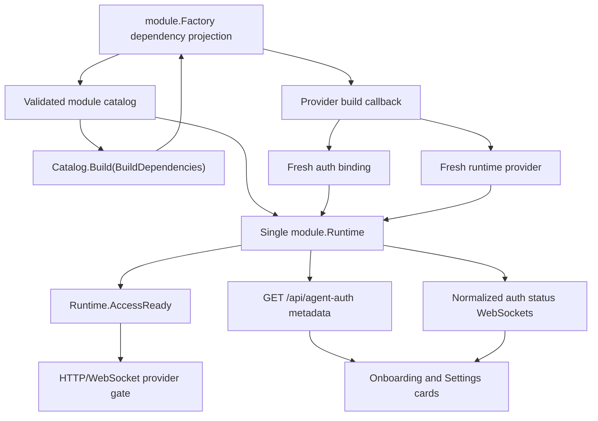

# Authentication and access

Agent authentication is declared by each provider module but executed through
provider-neutral services and transports. A factory chooses one supported auth
mode, builds the matching binding together with its runtime provider, and
lets the shared registry expose status and actions without provider-specific
frontend branches.

This is distinct from Remote user authentication. A user first needs a valid,
registered Remote session; the provider gate then decides whether the rest of
the application may open.

## Auth contract

The descriptor contract is in
[`module/factory.go`](../../../backend/internal/service/agent/module/factory.go), and
the runtime binding is in
[`auth/binding.go`](../../../backend/internal/service/agent/auth/binding.go).

| Descriptor mode | Binding | Behavior | May satisfy onboarding gate? |
| --- | --- | --- | --- |
| `managed-code` | `NewCodeBinding` | Remote starts an interactive CLI, extracts an authorization URL, accepts a pasted code, and streams status. | Yes |
| `managed-device` | `NewDeviceBinding` | Remote starts a device-login CLI, extracts its URL/code, waits for completion, and streams status. | Yes |
| `external` | `NewExternalBinding` | The provider owns login outside Remote's managed flow. The binding exposes no mutation or live status service. | No |
| `none` | No binding | No provider sign-in is required. The generic auth catalog reports the module ready. | Yes, when explicitly declared |

Every non-`none` descriptor must provide user-facing `AuthInstructions` and a
binding with the same provider ID and matching flow. Managed bindings must be
available; `none` must not build one. Factory/runtime construction fails when
those identities or modes drift.

An external module cannot declare `SatisfiesAccessGate`: Remote has no
authoritative status signal with which to open the gate. A catalog used by an
authenticated deployment must contain at least one managed or no-auth module
marked as a gate provider, otherwise service startup fails. Multiple modules
may be eligible; the gate opens when any one is ready.

## Startup and access-gate flow



`module.Catalog.Build` creates one `module.Runtime` atomically from the same
ordered factories. That runtime keeps the provider and auth registries private
and exposes consistent bindings, descriptors, readiness, and lookup methods.
Auth services are fresh for each runtime; packages must not retain mutable
login state in a global singleton.

When Remote user authentication is enabled, middleware applies the gates in
this order:

1. the caller has a valid Remote session;
2. the account is registered;
3. local-administrator setup is complete;
4. at least one module declared as an access gate is ready.

Agent-auth routes stay reachable before step 4 so onboarding can be completed.
Reading the auth catalog/status is available to registered users after local
admin setup. Starting, submitting, or canceling a managed login, and every
saved-account request, is restricted to administrators. When application auth
is disabled, those mutation handlers allow the local caller.

The frontend calculates the same readiness from `GET /api/agent-auth`: a gate
provider must have `status.authenticated: true`. `none` modules receive that
status synthetically. The shared cards are visible to registered users, but
the backend permits login mutations only for administrators; a non-admin
member must wait for an administrator to complete provider setup.

## HTTP and WebSocket surfaces

The normalized catalog is:

```text
GET /api/agent-auth
```

It returns providers in module registration order with ID, label, default,
execution scopes, auth mode/instructions/gate policy, and normalized status.

Existing managed flows use provider-derived mutation routes:

```text
POST /api/<provider>/login/start    # managed-code
POST /api/<provider>/login/code     # managed-code
POST /api/<provider>/login/cancel   # managed-code
POST /api/<provider>/login/device   # managed-device
```

Providers with saved accounts (Claude, Codex, and MiniMax) also register the account
routes in [Saved accounts](#saved-accounts). For them, `login/start` and
`login/device` return `400` because every login must name the account it
creates or reconnects; Claude's pasted code and cancellation still use
`login/code` and `login/cancel`. MiniMax creates and reconnects named accounts
through its API-key route instead of an interactive login. Their normalized `Snapshot` carries a
redacted `accounts` list (ID, label, email, plan, validation time, active
flag). Credentials are never returned.

`/ws/agent-auth/<provider>` streams the stable normalized `Snapshot` used by
the frontend. The older `/api/<provider>/auth-status` and
`/ws/<provider>/auth-status` routes expose provider-specific status payloads
for compatibility. External bindings have no live stream or login mutations;
their catalog entry supplies instructions instead. A `none` module has no auth
binding and therefore no provider-specific routes.

Route registration is generic and iterates the built runtime bindings. Adding
another provider that uses an existing mode does not require another handler,
WebSocket implementation, frontend card, or route constant.

## Current provider behavior

| Provider | Mode | Host login and readiness | Project behavior |
| --- | --- | --- | --- |
| Claude | `managed-code` | Runs `claude auth login --claudeai` in a PTY, reads the Anthropic URL, and accepts the pasted authorization code. Each login is a [saved-account](#saved-accounts) login in a private `CLAUDE_CONFIG_DIR`. A credential file under `~/.claude` holding a subscription login with a refresh token or an unexpired access token marks it authenticated. | A saved account is materialized into a stable per-chat `CLAUDE_CONFIG_DIR`. Only that private credential bundle is seeded and pulled for the run; refreshed credentials enter the matching vault record only after validation and an identity match. |
| Codex | `managed-device` | Runs `codex login --device-auth` with `OPENAI_API_KEY` removed. Each login is a [saved-account](#saved-accounts) login in an isolated `CODEX_HOME`. A non-empty auth mode other than `apikey` is considered authenticated; a missing, malformed, or mode-less `auth.json` is not. API-key auth produces a warning and is not considered authenticated. | A saved account is materialized into a stable per-chat `CODEX_HOME`, with API-key environment variables cleared. Only that private `auth.json` is seeded and pulled; refreshed credentials enter the matching vault record only after validation and an identity match. |
| MiniMax | `managed-api-key` | An admin saves one or more named, write-only Token Plan subscription keys in Settings. Remote rejects keys without the documented `sk-cp-…` prefix, then verifies each key with the non-generation `GET /v1/token_plan/remains` endpoint before saving it. Standard pay-as-you-go API keys are unsupported. | Project-only. The account selected on the chat resolves to one key, which is injected as an environment variable into that run's isolated Codex process and is not written into its generated model catalog. |
| Kimi | `managed-device` | Runs `kimi login`; any regular file under `~/.kimi-code/credentials` marks it authenticated. | The persistent project home can retain project-only credentials. Host credentials are synchronized according to the profile's directory policy. |
| Antigravity | `external` | Remote has no managed host login/status UI. An operator-prepared host login may support loose chats, but is outside the normal product flow. | Run `agy` in the project terminal and complete its URL/code flow. State survives replacement in the project's persistent Antigravity directory; refresh models afterward. |

Claude, Codex, Kimi, and MiniMax host identities are not per Remote user.
Claude, Codex, and MiniMax can keep several saved accounts and a chat can pin
one account ID. Claude and Codex materialize that selection in a private home
scoped to the account, project, and chat, so concurrent chats can run different
accounts without changing the canonical host login. MiniMax resolves the
selected key directly and likewise supports concurrent account use. Inactive
credentials stay in `agent-accounts.json` and are never
returned by the API. Kimi still has one managed host login. Antigravity's supported login is
project-local and shared with everyone who can access that project.

## Saved accounts

Claude, Codex, and MiniMax keep named credentials in a saved-account vault.
The composer stores an optional `accountId` on the chat, and the provider
adapter resolves it at run time. The account lifecycle
belongs to the service layer; the provider packages supply only the
credential mechanics:

| Owner | Responsibility |
| --- | --- |
| `AccountVault` and `AccountService` in [`service/agent/auth`](../../../backend/internal/service/agent/auth/account_service.go) | The account set and default account, label and activation rules, account logins, isolated run snapshots and capture, legacy run leases, startup reconciliation, and every write to the store |
| `AccountStore` in [`stores/fileauth`](../../../backend/internal/stores/fileauth/store.go) | `agent-accounts.json` in `DATA_DIR`: one account set per provider, mode `0600` |
| Provider `AccountCredentials` | Reading and writing the host login, provider validation, and the stable account identity a credential records |
| Provider `AccountLoginFlow` and `AccountLogin` | Running the CLI login in an isolated location and collecting what it wrote |

`module.Dependencies.Accounts` is the `*AccountVault`, not the store, and is
nil when no account store is configured. A provider opens its service with an
`AccountConfig`, attaches it to its binding with `WithAccounts`, calls
`CredentialForRun` before each saved-account run and `CaptureRunCredential` after a successful one, takes
its login environment from `LoginEnv`, and hands a finished login to
`FinishLogin`. The legacy `BeginRunFor`/`CaptureAfterRun` path remains for a
canonical host login that has not been imported. API-key providers use the same redacted account contract but
resolve the selected opaque key directly instead of materializing a file.

| Provider | Saved credential and identity | Validation | Login policy |
| --- | --- | --- | --- |
| Claude | The subscription entries of `.credentials.json` and the `oauthAccount` profile from the CLI's global config; other entries, such as MCP server tokens, stay on the host. Identity is the profile's `accountUuid`; its email, which can change, stands in only for a profile without one. | `claude auth status` in a private `CLAUDE_CONFIG_DIR`, plus an expiry check. Local only; Anthropic is not asked. | A new account login replaces a pending one, because an abandoned code login never finishes on its own. |
| Codex | `auth.json`. Identity is the ChatGPT account (`tokens.account_id`, else the ID token's `chatgpt_account_id` claim) and user (`chatgpt_user_id`, else `user_id`); the email claim stands in only for a token without a user ID. | The Codex app server refreshes and reads the account through OpenAI. | While an account login is pending, canonical-host imports, activations, and legacy runs are refused, because some builds, such as the Snap package, ignore the isolated `CODEX_HOME` and write the host `auth.json`, which the login then restores (`LoginMayWriteHost`). Saved-account runs use their private home and do not depend on the canonical file. |
| MiniMax | One opaque Token Plan key per record; only its label and validation timestamp are exposed. | The non-generation Token Plan quota endpoint. | The API-key form creates a named account or reconnects an existing one. No credential file or provider login subprocess is involved. |

Two identities name the same account when they share at least one identifier
and agree on every identifier both record. A validated login that records no
identifier is rejected, so every saved account has one.

### Account routes

| Route | Body | Effect | Response |
| --- | --- | --- | --- |
| `POST /api/<provider>/accounts/import` | `{label}` | Validates the current host login and saves it as a new, active account. | Snapshot |
| `POST /api/<provider>/accounts/login` | `{label, accountId?}` | Starts an isolated login for a new account, or reconnects `accountId`. A blank label keeps a reconnected account's label. | Login state |
| `POST /api/<provider>/accounts/activate` | `{accountId}` | Validates the saved account and makes it the host login. | Snapshot |
| `DELETE /api/<provider>/accounts` | `{accountId}` | Removes a saved account other than the active one. | Snapshot |

All four are administrator-only. "Snapshot" is the provider's normalized auth
`Snapshot`, including the redacted account list. Label errors return `400`,
an unknown account `404`, and a legacy run holding the canonical host login,
removing the active account, a login already in progress, or an identity mismatch `409`; anything
else, including a committed selection whose host write failed, is `500`.
Labels are trimmed, required, at most 64 characters, and unique per provider
regardless of case.

### Activation

Activation is one transition with a single committed authority, the account
store:

1. The request is refused only while a legacy run holds the canonical host
   login, and for Codex while an account login may be writing that host login.
2. The active account's host login is captured first, by the same rules as a
   capture after a run, so tokens the CLI refreshed are not overwritten by an
   older saved copy, including when the active account is selected again.
   This is best effort; a failure is logged.
3. The provider validates the target's saved credential, which may refresh it.
4. The validated credential must still identify the saved account; otherwise
   the request fails with an identity mismatch and the account must be
   reconnected.
5. The account set is saved. If saving fails, nothing changes.
6. The active credential is written to the host.

There is no rollback. If the host write fails, the selection stays committed,
the request reports that the account is selected but its credential could not
be written, and the host is marked stale. `BeginRun` writes the active
account again before any run and refuses runs while that keeps failing.
Import validates the current host login and then commits the same way.

### Account logins

An account login runs the provider's CLI login against an isolated location
(`LoginEnv`) instead of the host login. When the CLI exits, the provider's
completion calls `FinishLogin`, which collects the credential, removes the
isolated location, undoes any write the CLI made outside it, validates the
result, and saves it as a new account or in place of the reconnected one.
A reconnect must sign in to the same provider account; a login for another
account is rejected with an identity mismatch and belongs in a new account.
A new account becomes active and is written to the canonical host login unless
a legacy run holds the lease, in which case it is saved without being activated. A reconnect of
the active account keeps its identity, so its new login is written to the host
even while a legacy run holds the lease. A failure is reported in the
login state and saves nothing. Only one account login per provider can be
pending.

### Isolated account runs

For a saved Claude or Codex account, `CredentialForRun` returns an immutable
credential snapshot without changing the active account or canonical host
login. The provider derives a filesystem-safe scope from the account, project,
and chat IDs, writes the snapshot into that stable private home, and overrides
the run's credential spec and CLI home. Different chats therefore have separate
credential and provider-session files and may run different accounts
concurrently. Canonical instructions, settings, and skills are linked into the
private home rather than duplicated.

After a successful run, only its private credential files are pulled back.
`CaptureRunCredential` validates the result and requires it to identify the
same saved account. If that account was reconnected after the run began, the
newer vault value wins and the stale result is ignored. MiniMax needs no files:
its account ID resolves directly to one validated key. Changing a chat from one
explicit account ID to another clears that provider's resumable session while
keeping the visible Remote transcript.

`BeginRunFor` remains a compatibility path only when no saved default exists.
It reconciles and leases the canonical host login, retaining the older
single-slot behavior until that login is imported.

An isolated run also stamps its saved account ID on every event it emits
(`agentruntime.EmitForAccount`), so what the provider reports about that
account, such as its plan limits, is filed under it. Events from a legacy
host-login run carry no account ID. The Usage tab's plan-limit reads use the
same credential snapshots: each saved Claude or Codex account is read in a
private temporary home without a prompt, and a login the CLI refreshed there
goes through `CaptureRunCredential` like a run's. See
[Agent quota snapshots](../../03-platform/07-data-and-frontend-state.md#agent-quota-snapshots).

### Capture after runs

After a successful saved-account run, the provider calls
`CaptureRunCredential` so a login the CLI refreshed is kept. It does so even
when sync-back reported an error, because one file may already have been
copied. The isolated run copy enters the vault only after validation and an
identity match with the account snapshot that started the run:

| Isolated login after the run | Result |
| --- | --- |
| Unchanged from the saved copy | Nothing changes. |
| Records another account, or none | Not saved. The private home is overwritten from the vault before its next run, and an identity mismatch is logged. |
| Same account; passes validation and still matches afterwards | Saved into that account unless a reconnect already replaced its starting credential. |
| Same account; fails validation | Not saved. The failure may be transient, and the saved copy may hold a refresh token the CLI has since rotated. |

Legacy runs without a saved default still use `CaptureAfterRun` and the
canonical-host reconciliation rules described below.

### Startup reconciliation

When the runtime opens a provider's accounts, a canonical host login that
records the active account's identity is kept for administrator operations and
the legacy no-saved-account path. Any other host state, whether signed out,
unreadable, or another account, is replaced with the saved active credential.
A failed write is logged instead of failing startup and marks the host stale
for the next legacy run. Saved-account runs use their private homes and do not
depend on this canonical file. With no active account, the host login is left
alone.

## Auth timeout ownership

Authentication handshakes have provider-specific lifecycle limits because the
upstream protocols differ. These are intentionally unrelated to the global
capability-discovery deadline:

| Provider | Relevant current limits |
| --- | --- |
| Claude | 15 seconds to observe the URL, 10 minutes for the login process, 30 seconds to exit after code submission |
| Codex | 8 seconds to observe device-login details, 16-minute process limit, 15-minute displayed login TTL |
| Kimi | 8 seconds to observe device-login details, 30-minute process limit, 29-minute displayed login TTL |

Validating a finished account login is bounded at 30 seconds. Import and
activation validate within the request's context.

The shared `CodeService` owns PTY/session lifecycle, state subscriptions,
cancellation, and sanitized/truncated provider-facing errors. The shared
generic `DeviceService` owns device process lifecycle and subscriptions;
provider config supplies command syntax, URL/code patterns, authentication
detection, and completion wording.

`AGENT_CAPABILITY_TIMEOUT` does not alter login duration, credential transfer,
CLI installation, or normal agent runs.

## Authentication changes and model discovery

Authentication and capability caching are separate backend subsystems. The
frontend force-refreshes every currently mounted capability scope for that
browser/user when a managed provider's authenticated flag or active saved
account changes, or when a login reaches completed with a new start revision.
Intermediate URL, code, error, and warning changes do not trigger that
refresh. It does not globally delete the backend cache or proactively seed
every project container.

The next provider run performs profile-driven credential preparation. A manual
terminal login is not visible to the managed auth registry, so use **Refresh
models** after it. See
[`03-capabilities-cache-and-refresh.md`](03-capabilities-cache-and-refresh.md)
for the complete invalidation rules and
[`05-provisioning-and-updates.md`](05-provisioning-and-updates.md) for credential
placement.

## Adding authentication for a provider

When an existing mode fits:

1. Implement the provider-owned `NewAuth()` configuration when using a managed
   flow, or create an external binding when login is provider-owned.
2. Declare the mode, instructions, and gate eligibility in the provider's
   `NewFactory()`.
3. Build the binding inside the factory callback and use the exact descriptor
   provider ID.
4. Add provider auth tests and factory/catalog identity tests.
5. If credentials must reach project containers, describe them in `Profile()`;
   auth transport itself must not call LXD.
6. To offer saved accounts, implement `AccountCredentials` and
   `AccountLoginFlow`, open an `AccountService` from
   `module.Dependencies.Accounts`, and attach it with `WithAccounts`. Keep
   account persistence and selection out of the provider package.

A fundamentally different login protocol is a contract change. Add a new
module auth mode, binding operations and normalized snapshot semantics, generic
HTTP/WebSocket behavior, frontend rendering/actions, access-gate validation,
and tests as one deliberate feature. Do not hide a new protocol behind one of
the existing mode names.

Relevant code:

- provider-neutral binding and registry:
  `backend/internal/service/agent/auth/{binding,registry}.go`;
- shared code/device services:
  `backend/internal/service/agent/auth/{code,device}.go`;
- saved-account lifecycle and model:
  `backend/internal/service/agent/auth/{account_service,accounts}.go`;
- saved-account persistence (`agent-accounts.json`):
  `backend/internal/stores/fileauth/store.go`;
- provider configurations: `backend/internal/integration/agents/<provider>/auth.go`,
  with Claude's and Codex's account credentials and isolated logins in the
  same packages;
- host-authoritative credential push:
  `backend/internal/integration/containers/credentials/files.go`;
- HTTP catalog/actions:
  `backend/internal/transport/http/handlers/agent_auth_handler.go`;
- status WebSockets: `backend/internal/transport/ws/agent_auth_socket.go`;
- frontend orchestration:
  `frontend/src/state/hooks/auth/useAgentAuthRegistry.ts` and
  `frontend/src/ui/settings/AgentAuthSettings.tsx`.
