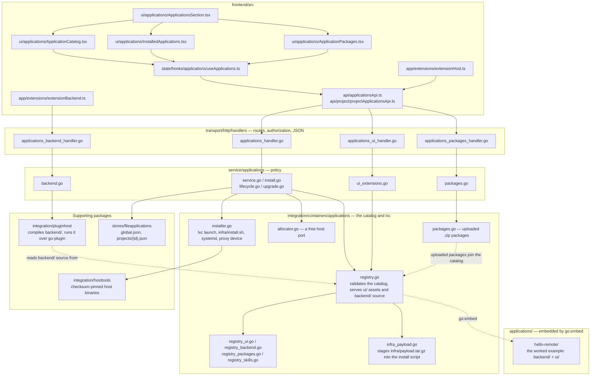

# 01 — Overview

## What the catalog is

The catalog is a directory of subdirectories. Each subdirectory is one
installable application:

```
applications/
  docs/              ← this documentation (reserved name, not an application)
  mysql/
    README.md                application documentation
    application.json         metadata and capability configuration
    infra/
      install.sh              provisioner, run inside a container
      package.sh              builds the optional infrastructure payload
      payload.tar.gz          files staged for install.sh
    backend/                  Go backend, compiled and run on the host
      main.go
    ui/                       browser extension
      scripts/main.js
      style/
      views/
      assets/
    skills/                   skills published to target projects
      example/SKILL.md
  postgresql/
  redis/
  ui-playground/       fixture: extension only, no container
  ui-sandbox/          fixture: extension only, no container
  backend-playground/  fixture: Go plugin plus the UI that calls it
```

The only regular files at an application root are `README.md` and
`application.json`. Everything executable or distributable is grouped by
capability: provisioning in `infra/`, server code in `backend/`, browser code
and assets in `ui/`, and project skills in `skills/`. These capability folders
are optional; the tree above shows the complete layout rather than a list of
required folders.

That directory is `applications/` at the repository root. The whole tree is compiled
into the server binary with `//go:embed applications` in
[`catalog.go`](../../../catalog.go) — a small module of its own, because
`go:embed` reaches only downwards, so a catalog at the root needs the directive
at the root — and
[`registry.go`](../../../backend/internal/integration/containers/applications/registry.go)
validates and serves what it embedded. There is no runtime backend directory, no
upload endpoint, and no way to add an application to a running server: adding one
means adding a directory and rebuilding. That single fact drives most of the
design, and the whole of the [security model](13-security-model.md).

Adding an application requires **no code changes**. `NewRegistry()` walks the
directory at startup, validates every entry, and the new app appears in the
Applications tab.

## One application, composable capabilities

```
                         application.json
            /                 |              |             \
 infra/install.sh         backend/          ui/           skills/
         |                    |              |               |
 provisions a container   runs on the    runs in the     is published to
 (optionally with a port)  host as a      browser         target projects
                           process
```

There are no application types and `application.json` has no `type` field.
Remote discovers capabilities from the package itself, and each capability is
optional and independent:

| Capability | Declared by | What Remote does |
|---|---|---|
| Infrastructure | `infra/install.sh`, or an `install` path inside `infra/` | Provisions software in a container |
| Network exposure | infrastructure plus `port.internal` | Allocates a host port and adds an LXD proxy device |
| Backend | `backend/` | Compiles and runs the Go backend on the host |
| UI | `ui/` | Loads the browser extension |
| Skills | `skills/*/SKILL.md` | Publishes skills to the target project |

An application may provide one capability or combine all of them. Adding or
removing a capability means adding or removing its folder; there is no manifest
discriminator to keep synchronized with the package layout.

| Application | Infrastructure | Backend | UI | Skills | Result |
|---|---|---|---|---|---|
| `postgresql` | yes | no | no | no | provisions a database |
| `mysql` | yes | no | yes | no | provisions a database and adds a Connect action |
| `ui-playground` | no | no | yes | no | extends only the browser UI |
| `backend-playground` | no | yes | yes | no | runs a host backend and exposes its actions in the UI |

The layout supplies these capabilities directly — see
[03 — Application capabilities](03-application-capabilities.md). `backend/` is covered in full by
[15 — Backend plugins](15-backend-plugins.md).

## The moving parts



Every arrow out of the service layer crosses an interface it declares itself:
`service/applications/ports.go` names `Registry`, `Installer`, `BackendHost`,
`Store` and `PortAllocator`, and the packages on the right implement them. That
is what keeps the domain testable without LXD, a Go toolchain, or a disk.

### Backend

| Layer | File | Responsibility |
|---|---|---|
| integration | `containers/applications/registry.go` | loads and validates the embedded catalog; serves `ui/` asset bytes and `backend/` source |
| integration | `containers/applications/installer.go` | everything `lxc`-facing: containers, install scripts, proxy devices |
| integration | `pluginhost/` | everything toolchain- and process-facing: compiling `backend/`, running it, forwarding calls |
| contract | `pkg/appplugin` | the types and interface a plugin is written against |
| service | `service/applications/service.go` | policy: install, lifecycle, which extensions a caller may load |
| service | `service/applications/backend.go` | policy: who may call a plugin, and when |
| transport | `transport/http/handlers/applications_handler.go` | routes, authorization, JSON |
| transport | `transport/http/handlers/applications_backend_handler.go` | forwarding a request to a plugin and its answer back |

The layering is strict: transport → service → integration. A handler never
runs `lxc` and never launches a process; the registry never decides who may see
what. `pkg/appplugin` sits outside the layering on purpose: it is the public
contract, so it depends on nothing but the standard library.

### Frontend

| File | Responsibility |
|---|---|
| `app/extensions/extensionHost.ts` | fetches the allowed extension list, injects CSS, imports entry modules |
| `app/extensions/extensionApi.ts` | builds the `remote` object handed to each extension |
| `state/stores/extensions/extensionStore.ts` | owns registered contributions and install visibility |
| `state/hooks/extensions/extensionContributionState.ts` | decides which contributions apply to a surface |
| `app/extensions/extensionBackend.ts` | resolves which running plugin a call reaches, and calls it |
| `config/extensions.ts` | the closed set of slot names and their icon sizing |
| `app/extensions/extensionPopup.ts` | the modal an extension can open |
| `ui/primitives/ExtensionSlot.tsx` | renders a slot's contributions into plain DOM nodes |

## What installing does

An install crosses every layer above and provisions only the capabilities the
application carries. An application without `infra/install.sh` works on a host
with no container runtime at all.

```mermaid
sequenceDiagram
    actor User
    participant UI as ApplicationCatalog.tsx
    participant API as applications_handler.go
    participant Svc as service/applications
    participant Reg as applications.Registry
    participant Store as stores/fileapplications
    participant Host as pluginhost
    participant Proj as project service
    participant Inst as applications.Installer
    participant LXD as LXD

    User->>UI: Install
    UI->>API: POST /api/applications<br/>or /api/projects/{id}/applications
    API->>Svc: Install(request)
    Svc->>Reg: the application, and its install script
    Reg-->>Svc: Application + script bytes (payload already staged)
    Svc->>Svc: resolve env — defaults, generated secrets, required fields

    alt application has infrastructure
        alt project scope
            Svc->>Proj: container name, and ready it
        else global scope
            Svc->>Svc: name a dedicated container
        end
        opt port.internal is declared
            Svc->>Svc: allocate a free host port, from defaultExternal up
        end
        Svc->>Store: persist as installing — a crash here stays recoverable
        Inst->>LXD: launch the dedicated container (global scope only)
        Inst->>LXD: run infra/install.sh as root, then start the systemd unit
        opt port.internal is declared
            Inst->>LXD: add the proxy device that maps the host port
        end
    else no infrastructure
        Note over Svc,LXD: no container, no port, no proxy device
    end

    opt application has backend/
        Svc->>Host: Ensure — compile if stale, then start the process
    end
    Note over Svc,Host: UI and skills need no provisioning;<br/>they become available from the running instance
    Svc->>Store: persist as running

    Svc-->>API: the instance
    API-->>UI: 200 — it appears under Installed
```

## How an extension reaches the screen

```
1. User installs an application        POST /api/applications
                                 (or /api/projects/{id}/applications)
                                          |
2. SPA re-syncs                  GET /api/applications/ui
                                 → [{ application, global, projectIds }]
                                          |
3. Host injects stylesheets      <link href="/api/applications/catalog/
                                          <id>/ui/style/*.css">
                                          |
4. Host imports the entry        import("/api/applications/catalog/
                                          <id>/ui/scripts/main.js")
                                          |
5. Entry module registers        remote.ui.addIconButton(slot, {...})
                                          |
6. A slot renders it             <ExtensionSlot name="chat.header.actions" />
                                 → contributions filtered by scope + `when`
                                 → each draws into its own <div>
                                          |
7. It calls its own backend      remote.backend.call("health")
                                 → /api/applications/<instance>/backend/health
                                 → the application's compiled Go plugin
```

Steps 2–6 repeat whenever the installed set changes — install, uninstall,
start, or stop — so a contributed button appears and disappears without a page
reload.

## Three gates, in order

An extension has to pass all three before anything of it appears:

1. **It must be in the catalog.** Built-in applications are embedded in the
   server binary; uploaded applications join the same registry from disk.
2. **The user must have installed it**, and the instance must be *running*.
   Being in the catalog puts nothing on anyone's screen. See
   [12 — HTTP API](12-http-api.md) for `GET /api/applications/ui`.
3. **The surface must be in scope.** A globally installed extension renders
   everywhere; one installed in a project renders only inside that project.
   See [08 — Scoping and visibility](08-scoping-and-visibility.md).

Gate 1 is a build decision. Gate 2 is enforced by the backend. Gate 3 is
enforced by the frontend registry, per contribution, on every render.

## Design decisions worth knowing

**Slots are a closed set.** An extension cannot render anywhere it likes. A
slot is a promise about where something draws and what context it receives, and
that promise is what survives refactors of the surrounding UI. Adding a slot is
a deliberate change to the SPA. See [05 — Slots](05-slots.md).

**Contributions are plain DOM.** An extension gets an `HTMLElement` and draws
into it however it likes. It never touches the component tree, so extension
code is ordinary JavaScript rather than Preact, and a throwing extension cannot
break the render of the surface around it.

**Failure is always local.** A broken entry module, a throwing predicate, a
throwing click handler, a missing view — each is caught and logged, and costs
that one extension its own UI. Everything else keeps working.

**The catalog fails loudly.** A malformed `application.json`, a `ui` block naming a
file that does not exist, or a port without infrastructure — all of
these fail `NewRegistry()`, which means the build and the tests fail. A broken
application never reaches a browser as a 404.
