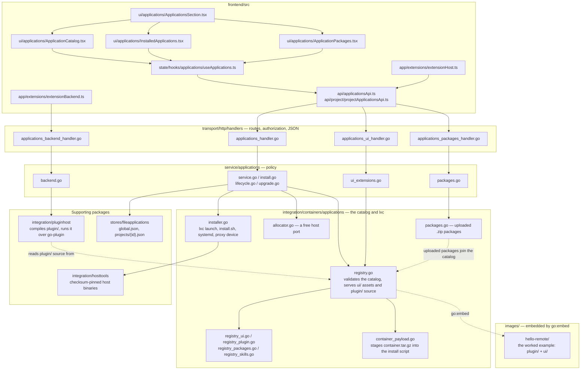
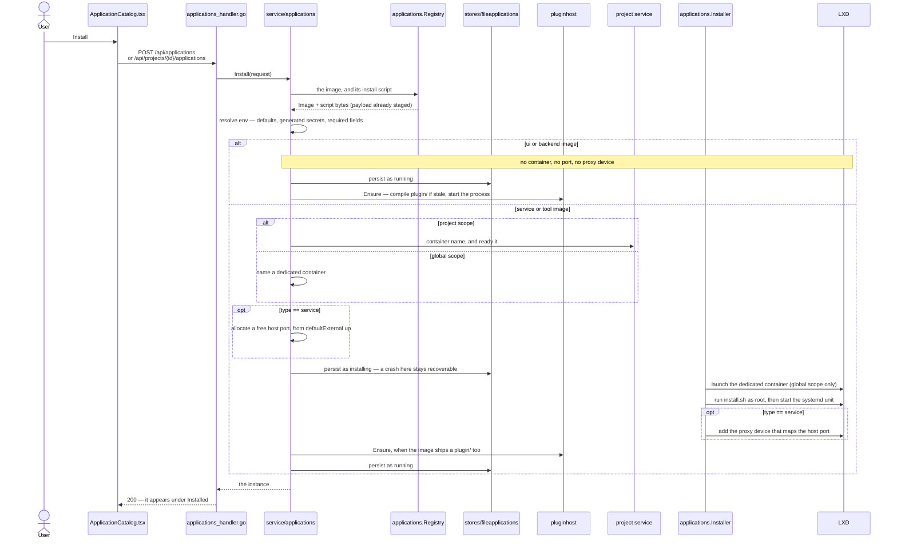

# 01 — Overview

## What the catalog is

The catalog is a directory of subdirectories. Each subdirectory is one
installable image:

```
images/
  docs/              ← this documentation (reserved name, not an image)
  mysql/
    image.json       metadata
    install.sh       provisioner, run inside a container
    ui/              browser extension (optional)
    plugin/          Go backend, compiled and run on the host (optional)
  postgresql/
  redis/
  ui-playground/       fixture: extension only, no container
  ui-sandbox/          fixture: extension only, no container
  backend-playground/  fixture: Go plugin plus the UI that calls it
```

The whole tree is compiled into the server binary with `//go:embed images` in
[`registry.go`](../../../backend/internal/integration/containers/applications/registry.go). There is no runtime plugin directory, no
upload endpoint, and no way to add an image to a running server: adding one
means adding a directory and rebuilding. That single fact drives most of the
design, and the whole of the [security model](13-security-model.md).

Adding an image requires **no code changes**. `NewRegistry()` walks the
directory at startup, validates every entry, and the new app appears in the
Applications tab.

## The three halves of an image

```
                         image.json
                    /         |         \
          install.sh        plugin/        ui/
               |               |             |
     runs in a container   runs on the   runs in the browser
     (a service on a port)  host as a    (buttons, panels, popups)
                            process
```

An image may have any of them, or all three:

| Image | `install.sh` | `plugin/` | `ui/` | What it is |
|---|---|---|---|---|
| `postgresql` | yes | no | no | a database |
| `mysql` | yes | no | yes | a database that also adds a "Connect" action |
| `ui-playground` | no | no | yes | a pure UI plugin |
| `backend-playground` | no | yes | yes | a Go backend and the UI that calls it |

The `type` field in `image.json` says which shape it is — see
[03 — Image types](03-image-types.md). `plugin/` is covered in full by
[15 — Backend plugins](15-backend-plugins.md).

## The moving parts



Every arrow out of the service layer crosses an interface it declares itself:
`service/applications/ports.go` names `Registry`, `Installer`, `BackendHost`,
`Store` and `PortAllocator`, and the packages on the right implement them. That
is what keeps the domain testable without LXD, a Go toolchain, or a disk.

### Backend

| Layer | File | Responsibility |
|---|---|---|
| integration | `containers/applications/registry.go` | loads and validates the embedded catalog; serves `ui/` asset bytes and `plugin/` source |
| integration | `containers/applications/installer.go` | everything `lxc`-facing: containers, install scripts, proxy devices |
| integration | `pluginhost/` | everything toolchain- and process-facing: compiling `plugin/`, running it, forwarding calls |
| contract | `pkg/appplugin` | the types and interface a plugin is written against |
| service | `service/applications/service.go` | policy: install, lifecycle, which extensions a caller may load |
| service | `service/applications/backend.go` | policy: who may call a plugin, and when |
| transport | `transport/http/handlers/applications_handler.go` | routes, authorization, JSON |
| transport | `transport/http/handlers/applications_backend_handler.go` | forwarding a request to a plugin and its answer back |

The layering is strict: transport → service → integration. A handler never
runs `lxc` and never launches a process; the registry never decides who may see
what. `pkg/appplugin` sits outside the layering on purpose: it is the public
contract, so it depends on nothing but the standard library.

### Frontend

| File | Responsibility |
|---|---|
| `app/extensions/extensionHost.ts` | fetches the allowed extension list, injects CSS, imports entry modules |
| `app/extensions/extensionApi.ts` | builds the `remote` object handed to each extension |
| `state/stores/extensions/extensionStore.ts` | owns registered contributions and install visibility |
| `state/hooks/extensions/extensionContributionState.ts` | decides which contributions apply to a surface |
| `app/extensions/extensionBackend.ts` | resolves which running plugin a call reaches, and calls it |
| `config/extensions.ts` | the closed set of slot names and their icon sizing |
| `app/extensions/extensionPopup.ts` | the modal an extension can open |
| `ui/primitives/ExtensionSlot.tsx` | renders a slot's contributions into plain DOM nodes |

## What installing does

An install crosses every layer above, and what it actually provisions depends
entirely on the image's type — which is the single most surprising thing about
this subsystem, and the reason a `ui` or `backend` image works on a host with
no container runtime at all.



## How an extension reaches the screen

```
1. User installs an image        POST /api/applications
                                 (or /api/projects/{id}/applications)
                                          |
2. SPA re-syncs                  GET /api/applications/ui
                                 → [{ image, global, projectIds }]
                                          |
3. Host injects stylesheets      <link href="/api/applications/catalog/
                                          <id>/ui/style/*.css">
                                          |
4. Host imports the entry        import("/api/applications/catalog/
                                          <id>/ui/scripts/main.js")
                                          |
5. Entry module registers        remote.ui.addIconButton(slot, {...})
                                          |
6. A slot renders it             <ExtensionSlot name="chat.header.actions" />
                                 → contributions filtered by scope + `when`
                                 → each draws into its own <div>
                                          |
7. It calls its own backend      remote.backend.call("health")
                                 → /api/applications/<instance>/backend/health
                                 → the image's compiled Go plugin
```

Steps 2–6 repeat whenever the installed set changes — install, uninstall,
start, or stop — so a contributed button appears and disappears without a page
reload.

## Three gates, in order

An extension has to pass all three before anything of it appears:

1. **It must be in the build.** The catalog is embedded; there is no runtime
   installation of new images.
2. **The user must have installed it**, and the instance must be *running*.
   Being in the catalog puts nothing on anyone's screen. See
   [12 — HTTP API](12-http-api.md) for `GET /api/applications/ui`.
3. **The surface must be in scope.** A globally installed extension renders
   everywhere; one installed in a project renders only inside that project.
   See [08 — Scoping and visibility](08-scoping-and-visibility.md).

Gate 1 is a build decision. Gate 2 is enforced by the backend. Gate 3 is
enforced by the frontend registry, per contribution, on every render.

## Design decisions worth knowing

**Slots are a closed set.** An extension cannot render anywhere it likes. A
slot is a promise about where something draws and what context it receives, and
that promise is what survives refactors of the surrounding UI. Adding a slot is
a deliberate change to the SPA. See [05 — Slots](05-slots.md).

**Contributions are plain DOM.** An extension gets an `HTMLElement` and draws
into it however it likes. It never touches the component tree, so extension
code is ordinary JavaScript rather than Preact, and a throwing extension cannot
break the render of the surface around it.

**Failure is always local.** A broken entry module, a throwing predicate, a
throwing click handler, a missing view — each is caught and logged, and costs
that one extension its own UI. Everything else keeps working.

**The catalog fails loudly.** A malformed `image.json`, a `ui` block naming a
file that does not exist, a `type` that declares a port it cannot have — all of
these fail `NewRegistry()`, which means the build and the tests fail. A broken
image never reaches a browser as a 404.
