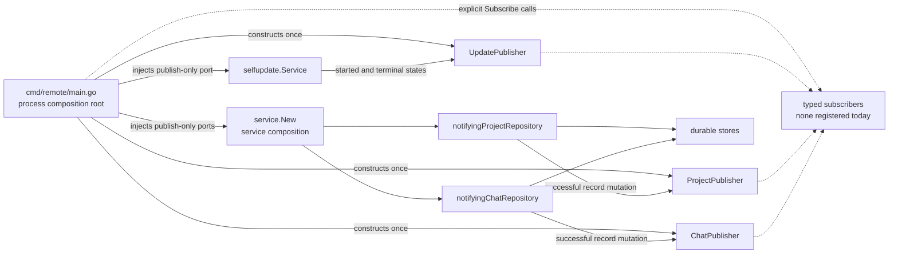
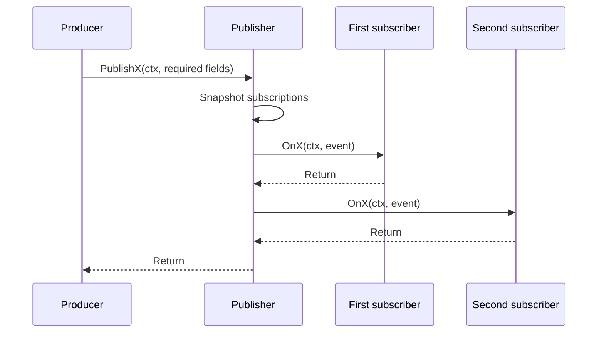
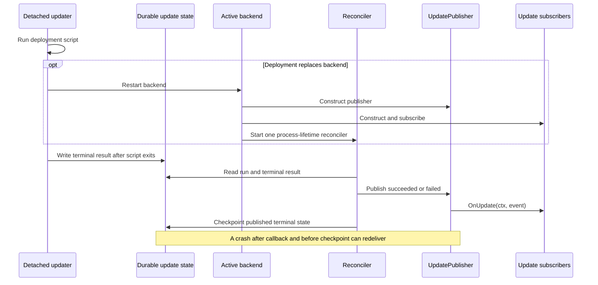
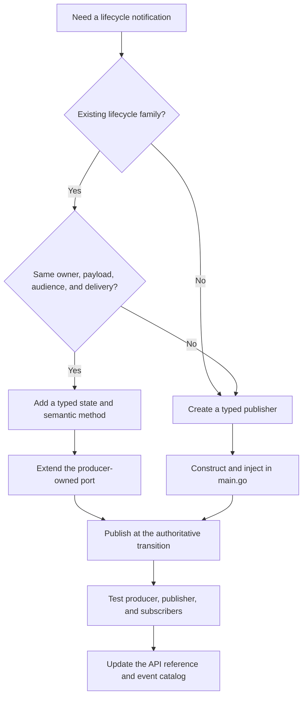

# Lifecycle event API

`backend/internal/lifecycle` provides typed, in-process notifications between
already constructed application components. Use it when one component owns a
documented lifecycle transition and another component needs to react without
being called directly by the producer.

Lifecycle publishers are deliberately smaller than a message bus. They have no
discovery, persistence, buffering, retry, transport, or global registry. Every
publisher is an ordinary dependency constructed at the process composition
root.

The current runtime provides three event families:

- application self-updates;
- persisted project records; and
- persisted chat records.

No production subscriber is registered today. The publishers and producer
wiring are available for new reactions without coupling those reactions to the
workflows that emit them.

## API at a glance

Import the package as:

```go
import "github.com/futrx-com/remote.futrx.com/internal/lifecycle"
```

| Family | Constructor | Subscribe method | Subscriber callback |
| --- | --- | --- | --- |
| Self-update | `lifecycle.NewUpdatePublisher()` | `(*UpdatePublisher).Subscribe(UpdateSubscriber) func()` | `OnUpdate(context.Context, UpdateEvent)` |
| Project record | `lifecycle.NewProjectPublisher()` | `(*ProjectPublisher).Subscribe(ProjectSubscriber) func()` | `OnProject(context.Context, ProjectEvent)` |
| Chat record | `lifecycle.NewChatPublisher()` | `(*ChatPublisher).Subscribe(ChatSubscriber) func()` | `OnChat(context.Context, ChatEvent)` |

Each `Subscribe` call returns an idempotent unsubscribe function. Each public
publish method constructs one supported typed event; there is intentionally no
public raw `Publish(any)` API.

### Self-update API

```go
type UpdateState string

const (
    UpdateStarted   UpdateState = "started"
    UpdateSucceeded UpdateState = "succeeded"
    UpdateFailed    UpdateState = "failed"
)

type UpdateEvent struct {
    State     UpdateState
    Target    string
    Kind      string
    StartedBy string
}

type UpdateSubscriber interface {
    OnUpdate(context.Context, UpdateEvent)
}

func NewUpdatePublisher() *UpdatePublisher
func (*UpdatePublisher) Subscribe(UpdateSubscriber) func()
func (*UpdatePublisher) PublishUpdateStarted(context.Context, string, string, string)
func (*UpdatePublisher) PublishUpdateSucceeded(context.Context, string, string, string)
func (*UpdatePublisher) PublishUpdateFailed(context.Context, string, string, string)
```

Source: [`update_publisher.go`](../../backend/internal/lifecycle/update_publisher.go).

`Target` is the target release tag, `Kind` is currently `application` or
`infrastructure`, and `StartedBy` is the account that initiated the update.
`StartedBy` is private application data even though the event contains no
credential or token.

### Project API

```go
type ProjectState string

const (
    ProjectCreated ProjectState = "created"
    ProjectUpdated ProjectState = "updated"
    ProjectDeleted ProjectState = "deleted"
)

type ProjectEvent struct {
    State     ProjectState
    ProjectID string
}

type ProjectSubscriber interface {
    OnProject(context.Context, ProjectEvent)
}

func NewProjectPublisher() *ProjectPublisher
func (*ProjectPublisher) Subscribe(ProjectSubscriber) func()
func (*ProjectPublisher) PublishProjectCreated(context.Context, string)
func (*ProjectPublisher) PublishProjectUpdated(context.Context, string)
func (*ProjectPublisher) PublishProjectDeleted(context.Context, string)
```

Source: [`project_publisher.go`](../../backend/internal/lifecycle/project_publisher.go).

### Chat API

```go
type ChatState string

const (
    ChatCreated ChatState = "created"
    ChatUpdated ChatState = "updated"
    ChatDeleted ChatState = "deleted"
)

type ChatEvent struct {
    State  ChatState
    ChatID string
}

type ChatSubscriber interface {
    OnChat(context.Context, ChatEvent)
}

func NewChatPublisher() *ChatPublisher
func (*ChatPublisher) Subscribe(ChatSubscriber) func()
func (*ChatPublisher) PublishChatCreated(context.Context, string)
func (*ChatPublisher) PublishChatUpdated(context.Context, string)
func (*ChatPublisher) PublishChatDeleted(context.Context, string)
```

Source: [`chat_publisher.go`](../../backend/internal/lifecycle/chat_publisher.go).

Project and chat events contain only their stable record ID. Do not add full
metadata merely to save a subscriber lookup: project metadata contains a
pointer, chat metadata contains maps and slices, and copying either struct would
still expose mutable references to subscribers. Their metadata also includes
paths, configuration, and provider session information that most reactions do
not need.

## Available events

The named constants in each family are its event list. There is no runtime
`[]any` catalog. Adding a constant alone is not enough: every supported state
also needs a semantic publish method, a real emission point, tests, and a row in
this section.

### Self-update events

| Event | Emission point | Replay and ordering |
| --- | --- | --- |
| `UpdateStarted` (`started`) | Synchronously after durable run preparation and before `HostClient.StartUpdater`; launch is about to be attempted but has not succeeded yet | In-memory only; not replayed after process replacement |
| `UpdateSucceeded` (`succeeded`) | The reconciler observes a durable successful updater result | Recovered after restart and checkpointed after callbacks |
| `UpdateFailed` (`failed`) | Immediately after `StartUpdater` fails, or when reconciliation sees a non-zero done marker or a dead updater with no result | Launch failure is not replayed; reconciled failure is checkpointed after callbacks |

The producing workflow is
[`selfupdate.Service`](../../backend/internal/service/selfupdate/service.go),
which depends on its own publish-only
[`UpdateLifecyclePublisher`](../../backend/internal/service/selfupdate/ports.go)
port.

### Project record events

| Event | Exact meaning | Current production paths |
| --- | --- | --- |
| `ProjectCreated` (`created`) | `project.Repository.Create` successfully persisted a record | Project creation |
| `ProjectUpdated` (`updated`) | `project.Repository.Update` or `SetStatus` successfully persisted a record | Rename, resource limits, each reordered project, start/stop/restart/upgrade status, create completion/error, and startup status reconciliation |
| `ProjectDeleted` (`deleted`) | `project.Repository.Delete` returned success | Final record deletion after required chat cleanup |

These are persisted-record facts, not user-action or container-control events.
Important consequences:

- Project creation first writes a `provisioning` record. Subscribers normally
  receive `ProjectCreated`, followed by `ProjectUpdated` when status becomes
  `running` or `error`. The callback runs before creator access is seeded and
  before container provisioning starts, so only the initial record is
  guaranteed at that point; `ProjectCreated` does not mean the workspace is
  ready.
- `ProjectUpdated` does not identify which field changed. Even a no-op mutation
  that successfully rewrites the record is an update.
- Reorder writes projects one at a time. Earlier updates can be delivered before
  a later item fails.
- `ProjectDeleted` means the record was removed. Container, secret, and access
  cleanup are currently best-effort, so it does not promise that every external
  artifact was removed.
- Secrets, project membership, shares, browser-only state changes, and network
  repair do not publish directly. `StartAgentBrowser` can still cause
  `ProjectUpdated` through its prerequisite project-status write.
- The publisher belongs to the running `remote` process. The standalone
  `upgrade-workspaces` executable uses the raw project store and does not emit
  into another process's in-memory publisher.

The authoritative hooks are in
[`notifyingProjectRepository`](../../backend/internal/service/notifying_repositories.go).
It receives the publish-only
[`ProjectLifecyclePublisher`](../../backend/internal/service/lifecycle_ports.go)
port during service composition.

### Chat record events

| Event | Exact meaning | Current production paths |
| --- | --- | --- |
| `ChatCreated` (`created`) | `chat.Repository.Create` successfully persisted a record | New chat and the new record created by Fork |
| `ChatUpdated` (`updated`) | `chat.Repository.Update` successfully persisted a record | Metadata changes, mark read/unread, automatic title, provider session persistence, and stale-session recovery |
| `ChatDeleted` (`deleted`) | `chat.Repository.Delete` returned success | User deletion after run cancellation and project-deletion cascade |

These report successful repository operations. In particular, `ChatDeleted`
can also follow an idempotent delete of a valid ID whose record is already
missing.

Important consequences:

- Fork emits `ChatCreated` after creating the destination record but before it
  finishes copying history. A later copy failure does not undo that durable
  record or the already delivered event. There is no `ChatForked` event today.
- `ChatUpdated` means the repository's `Update` operation succeeded. It does not
  mean every part of a chat changed.
- Appending or rewinding transcript events does not emit `ChatUpdated`.
- Starting, finishing, failing, or canceling an agent run does not directly emit
  a dedicated event. Metadata writes during a run can still emit `ChatUpdated`;
  add a separate chat-run family if a consumer needs the run transitions.
- No transcript text, prompt, tool input/output, usage payload, or provider
  session ID is included in a lifecycle event.

The authoritative hooks are in
[`notifyingChatRepository`](../../backend/internal/service/notifying_repositories.go).
It receives the publish-only
[`ChatLifecyclePublisher`](../../backend/internal/service/lifecycle_ports.go)
port during service composition.

## Ownership and dependency flow

Each role has one owner:

| Role | Responsibility |
| --- | --- |
| Event contract | Defines one cohesive family's typed states and smallest safe payload |
| Concrete publisher | Owns subscriptions and synchronous dispatch for that family |
| Producer-owned port | Exposes only the semantic publish methods the producer calls |
| Producer | Publishes after the workflow or persistence transition it authoritatively owns |
| Subscriber | Owns one reaction; it does not become a second owner of the producer workflow |
| Composition root | Constructs publishers, injects producer ports, and explicitly registers subscribers |



There is intentionally no `Registry`, `Bindings`, automatic package
registration, reflection-based routing, or package-level singleton. Producers
do not construct or import a concrete publisher. The concrete publishers satisfy
small interfaces owned next to the producing code.

## Delivery contract

For each publish call, every lifecycle publisher:

1. snapshots the current subscriptions while holding its read lock;
2. releases that lock;
3. invokes the snapshot synchronously in registration order; and
4. passes the caller's context and an event value to each callback.



These details are part of the API contract:

- Registration order applies within one publish call. Separate concurrent
  publish calls can overlap and can invoke the same subscriber concurrently.
- The publisher protects its subscription list, not subscriber-owned state.
  Subscribers must synchronize their own mutable state.
- A callback may subscribe or unsubscribe without deadlocking. The change
  affects later snapshots only.
- Unsubscribing does not cancel a callback already captured in the current
  snapshot. Calling the returned unsubscribe function more than once is safe.
- A canceled context is still dispatched. Each subscriber decides how its
  reaction honors cancellation.
- Callbacks do not return errors. A subscriber owns its own recovery, logging,
  and retry policy.
- Publishers do not recover panics. A panic skips later subscribers and unwinds
  into the producer. For a project or chat mutation, the durable write has
  succeeded and `workspacehub` publication has already been attempted. A panic
  during `UpdateStarted` prevents `StartUpdater` from being called; a terminal
  callback panic during the reconciler's synchronous first pass aborts startup,
  while one in its polling goroutine terminates the process.
- Slow work blocks the producer and every later subscriber. A slow reaction
  needs a subscriber-owned bounded queue with explicit overload and shutdown
  behavior. Queue event data, not the request context; that context can be
  canceled as soon as the callback returns.
- Do not subscribe a nil implementation. It is accepted during registration but
  panics when the next event invokes it.

The shared delivery mechanics are private in
[`dispatcher.go`](../../backend/internal/lifecycle/dispatcher.go). Public event
construction and subscriber contracts remain domain-specific.

## In-memory delivery, replay, and restart

Publisher instances and subscription lists exist only in one process:

- project and chat events are never replayed;
- a subscriber registered after a project or chat mutation does not receive
  historical events;
- direct calls to a raw repository outside the composed `remote` process do not
  publish; and
- a process restart discards every subscription and creates new publisher
  instances in `main.go`.

Durability, where required, belongs to the producing workflow. Self-update is
the current example because a successful update replaces the backend that
started it.



`StartLifecycleReconciler` performs one synchronous pass before starting its
polling goroutine. If the first pass fails, polling is not started. Once running,
transient read or checkpoint errors are retried on later ticks. Start it once
with the process-lifetime context; it is not a restartable worker.

Terminal self-update delivery is at-least-once across the callback/checkpoint
crash window, not exactly once. Terminal subscribers must make their effects
idempotent. The current payload has no unique attempt ID, so use an inherently
idempotent operation or a domain-appropriate key rather than claiming exact
deduplication.

`UpdateStarted` receives the initiating request context. A reconciled terminal
event can be delivered by a replacement process with that process's context, so
subscribers must not rely on request-scoped values surviving an update.

## Lifecycle publishers versus other event mechanisms

Do not interchange lifecycle publishers with `workspacehub` or the chat
transcript stream.

| Mechanism | Purpose | Delivery |
| --- | --- | --- |
| `internal/lifecycle` | Typed application reactions to lifecycle facts | Synchronous, registration ordered, caller context, no buffer or replay |
| [`workspacehub`](../../backend/internal/service/workspacehub/hub.go) | Push current project/chat read models to WebSocket clients | Buffered channels, no context, unordered subscriber map, slow clients dropped and closed |
| Chat `Event` stream | Durable conversation, tool, interaction, and usage history | Persisted and sequence-addressed; can contain sensitive or high-volume content |

The project/chat persistence decorators publish existing `workspacehub` events
before lifecycle callbacks. A slow or panicking lifecycle subscriber therefore
cannot suppress the established WebSocket notification. The event sets still
differ:

- `workspacehub` uses `project.upsert`, `project.delete`, `chat.upsert`, and
  `chat.delete` transport messages;
- selected transcript appends, rewinds, and in-memory chat running-state changes
  can publish `chat.upsert` without emitting `ChatUpdated`; and
- lifecycle events carry only a typed state and stable ID, not a frontend read
  model.

## Add a subscriber

### 1. Implement exactly one typed callback

Put the reaction with the service or adapter that owns its side effect. This
example records project deletion:

```go
package projectaudit

import (
    "context"

    "github.com/futrx-com/remote.futrx.com/internal/lifecycle"
)

type Subscriber struct {
    audit AuditWriter
}

var _ lifecycle.ProjectSubscriber = (*Subscriber)(nil)

func (s *Subscriber) OnProject(ctx context.Context, event lifecycle.ProjectEvent) {
    switch event.State {
    case lifecycle.ProjectDeleted:
        if err := s.audit.RecordProjectDeletion(ctx, event.ProjectID); err != nil {
            // Handle or log the failure here. It cannot be returned to the publisher.
        }
    case lifecycle.ProjectCreated, lifecycle.ProjectUpdated:
        // This subscriber has no reaction to these states.
    }
}
```

Use a pointer receiver when the subscriber owns mutable dependencies or state.
The compile-time assertion makes an accidental callback signature change fail
at build time.

### 2. Construct and subscribe before publication can begin

Register subscribers explicitly in
[`cmd/remote/main.go`](../../backend/cmd/remote/main.go). Subscribe before giving
the publisher to a component that can publish:

```go
projectLifecycle := lifecycle.NewProjectPublisher()
chatLifecycle := lifecycle.NewChatPublisher()

projectAudit := projectaudit.New(/* dependencies available before services start */)
unsubscribeProjectAudit := projectLifecycle.Subscribe(projectAudit)
defer unsubscribeProjectAudit()

serviceSet, err := service.New(ctx, service.Dependencies{
    Chats:            storeSet.Chats,
    ChatLifecycle:    chatLifecycle,
    Projects:         storeSet.Projects,
    ProjectLifecycle: projectLifecycle,
    // Other dependencies omitted.
})
```

`service.New` is a nested composition root and starts background work before it
returns. A subscriber that must observe all project/chat activity must therefore
be registered before `service.New` receives those publishers. If a proposed
subscriber cannot be constructed without the completed `serviceSet`, either
depend on a narrower component available earlier or separate construction from
startup; registering afterward explicitly accepts a window of missed events.

For self-update, register before `StartLifecycleReconciler`, whose first pass is
synchronous and can deliver a terminal event immediately.

### 3. Register multiple subscribers explicitly

Registration calls define callback order:

```go
unsubscribeAudit := chatLifecycle.Subscribe(chatAudit)
defer unsubscribeAudit()

unsubscribeNotifications := chatLifecycle.Subscribe(chatNotifications)
defer unsubscribeNotifications()
```

Do not add a binding catalog solely to shorten these calls. Explicit wiring
makes startup order and ownership visible.

### 4. Test the subscriber at its boundary

Test every state that changes the subscriber's behavior and every state it must
ignore. If callbacks can overlap, run concurrent callback tests. For self-update
terminal reactions, deliver the same event twice and prove the external result
remains correct.

## Publish an existing event

Application policy should depend on a producer-owned interface, not a concrete
publisher. Existing project/chat record events are emitted by the persistence
decorators through
[`lifecycle_ports.go`](../../backend/internal/service/lifecycle_ports.go):

```go
type ProjectLifecyclePublisher interface {
    PublishProjectCreated(context.Context, string)
    PublishProjectUpdated(context.Context, string)
    PublishProjectDeleted(context.Context, string)
}
```

Call the semantic method only at the authoritative transition:

```go
next, err := repository.Update(ctx, id, mutate)
if err == nil {
    lifecycle.PublishProjectUpdated(ctx, string(id))
}
return next, err
```

Before adding another call, define all of these details:

- what durable or in-memory fact makes the event true;
- whether publication is before or after the side effect;
- whether a failed or partially successful operation emits;
- whether repeated or no-op operations emit;
- which context is forwarded; and
- whether a restart can lose or repeat the event.

Pin the decision in a producer test. Validation failures and rejected operations
must not accidentally publish.

## Add an event to an existing family

Use an existing family only when the new event has the same lifecycle owner,
required payload, subscriber audience, and delivery guarantees.



### 1. Add the typed constant and semantic publish method

For an illustrative project state that does not exist today:

```go
const (
    ProjectCreated  ProjectState = "created"
    ProjectUpdated  ProjectState = "updated"
    ProjectDeleted  ProjectState = "deleted"
    ProjectArchived ProjectState = "archived" // Example only; not implemented.
)

func (p *ProjectPublisher) PublishProjectArchived(ctx context.Context, projectID string) {
    p.publish(ctx, ProjectArchived, projectID)
}
```

Keep raw dispatch private. Semantic methods prevent callers from constructing
unsupported states.

### 2. Extend only the producer port that needs it

```go
type ProjectLifecyclePublisher interface {
    PublishProjectCreated(context.Context, string)
    PublishProjectUpdated(context.Context, string)
    PublishProjectDeleted(context.Context, string)
    PublishProjectArchived(context.Context, string)
}
```

The compiler identifies concrete publishers and test doubles that must change
with the port.

### 3. Emit and test the exact transition

Publish once at the owner that makes `archived` true. Test event count, payload,
context, and ordering relative to the operation's existing side effects. Do not
infer `archived` from a controller route name or add it as an alias for a normal
record update.

### 4. Update subscribers and this catalog

The subscriber interface stays one method for the whole family, so adding a
state does not force no-op methods onto every subscriber. Update state switches,
publisher tests, producer tests, subscriber tests, the API snippet, and the
event table together.

Do not add optional fields to turn one event into a bag of unrelated payloads.
If only one state needs a materially different payload or audience, create a
separate family.

## Add a new publisher and event family

Create another publisher only for a cohesive lifecycle with this same
synchronous, in-memory delivery model.

### 1. Define the event list and subscriber contract

Create `backend/internal/lifecycle/job_publisher.go`:

```go
package lifecycle

import "context"

type JobState string

const (
    JobQueued   JobState = "queued"
    JobStarted  JobState = "started"
    JobFinished JobState = "finished"
)

type JobEvent struct {
    State JobState
    JobID string
}

type JobSubscriber interface {
    OnJob(context.Context, JobEvent)
}
```

Use one discriminated event value when every state shares required fields and
subscribers. Prefer required immutable values. Do not use `any`, optional fields
for unrelated states, secrets, mutable domain aggregates, transport DTOs, or
persistence records.

### 2. Implement the concrete publisher

Use `ProjectPublisher` or `ChatPublisher` as the reference. Keep the public API
domain-specific while reusing the package-private dispatcher:

```go
type JobPublisher struct {
    events eventDispatcher[JobEvent]
}

func NewJobPublisher() *JobPublisher {
    return &JobPublisher{}
}

func (p *JobPublisher) Subscribe(subscriber JobSubscriber) func() {
    return p.events.subscribe(func(ctx context.Context, event JobEvent) {
        subscriber.OnJob(ctx, event)
    })
}

func (p *JobPublisher) PublishJobQueued(ctx context.Context, jobID string) {
    p.events.publish(ctx, JobEvent{State: JobQueued, JobID: jobID})
}
```

Add one semantic method per supported state. Do not export the dispatcher or a
generic publish method.

### 3. Give the producer a narrow port

Define the interface next to the producing workflow:

```go
type JobLifecyclePublisher interface {
    PublishJobQueued(context.Context, string)
    PublishJobStarted(context.Context, string)
    PublishJobFinished(context.Context, string)
}
```

Store that interface on the producer and inject it. Do not construct
`lifecycle.JobPublisher` inside the service.

### 4. Compose before startup

Construct the publisher in `cmd/remote/main.go`, register subscribers, then pass
the publisher through the producer's dependency contract before any handler,
reconciler, or worker can emit.

### 5. Test the complete boundary

Add focused tests for:

- each semantic method's exact state and payload;
- context forwarding through the real producer boundary;
- no event before a failed transition becomes true;
- side-effect and callback ordering;
- every subscriber's handled and ignored states; and
- any family-specific restart, replay, duplicate, or partial-success behavior.

The shared dispatcher is already characterized for registration order,
concurrent publishes, subscription changes during callbacks, idempotent
unsubscribe, and snapshot delivery. Add new delivery-mechanics tests only when a
new family intentionally changes that contract.

If the requirement is asynchronous, cross-process, replayable, or retryable,
use a bounded queue, durable workflow state, outbox, or transport designed for
that guarantee. Do not add special cases to the in-memory dispatcher.

## Verification

Run the narrowest affected packages first:

```bash
cd backend
go test -race \
  ./internal/lifecycle \
  ./internal/service/selfupdate \
  ./internal/service/project \
  ./internal/service/chat \
  ./internal/service
```

Then run the complete backend validation:

```bash
go test ./...
go vet ./...
go build ./...
```

For documentation changes:

```bash
cd ../docs.remote.futrx.com
npm test
npm run build
```

The focused behavioral references are:

- [`update_publisher_test.go`](../../backend/internal/lifecycle/update_publisher_test.go)
  for delivery order, context, unsubscribe, reentrant subscription changes,
  snapshot behavior, and concurrent dispatch;
- [`project_publisher_test.go`](../../backend/internal/lifecycle/project_publisher_test.go)
  and [`chat_publisher_test.go`](../../backend/internal/lifecycle/chat_publisher_test.go)
  for each current event mapping;
- [`notifying_repositories_lifecycle_test.go`](../../backend/internal/service/notifying_repositories_lifecycle_test.go)
  for successful producer emission, WebSocket ordering, failure suppression,
  and the transcript-mutation boundary; and
- [`selfupdate/service_test.go`](../../backend/internal/service/selfupdate/service_test.go)
  for start-before-launch ordering, terminal reconciliation, checkpointing,
  restart behavior, and launch failure.

Before finishing an extension, confirm:

- the event belongs to one cohesive lifecycle family;
- its payload contains only precise, required, safe values;
- the producer sees only its local publish-only port;
- the event is emitted exactly where its documented fact becomes true;
- subscribers are registered before publication can begin;
- subscribers are fast, concurrency-safe, non-panicking, and idempotent where
  redelivery is possible;
- process, context, partial-success, and failure behavior are explicit; and
- the code, tests, API snippets, and current event catalog agree.
