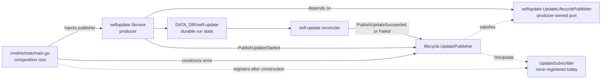
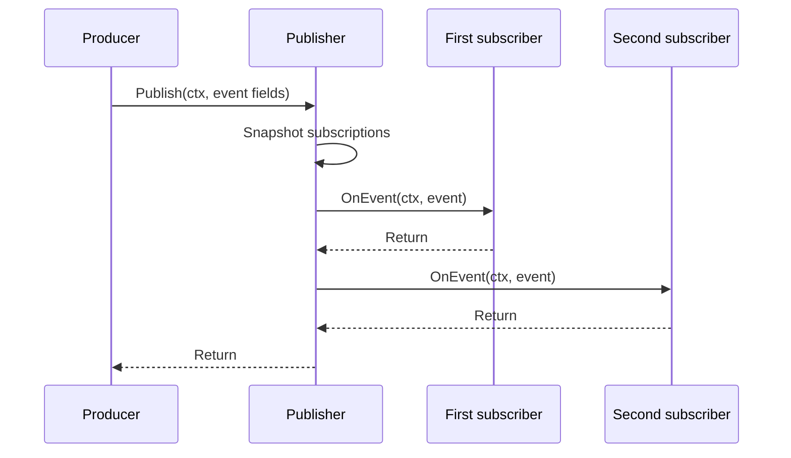
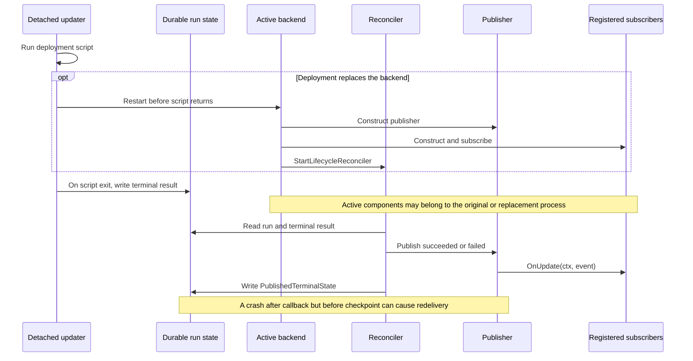
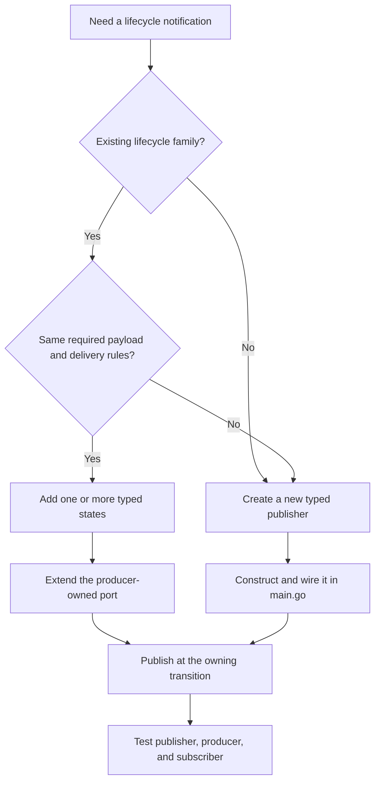

# Lifecycle publishers and subscribers

`internal/lifecycle` owns two related in-process notification layers:

- typed publishers for core workflows, with domain-specific event values and
  subscriber interfaces; and
- `EventBus`, the dynamic envelope used for validated application-manifest
  publishers and subscriptions.

Neither layer is durable: there is no persistence, replay, retry, external
transport, automatic discovery, or package-level global registry.

The current runtime has two typed domain publishers. `UpdatePublisher` reports
Remote self-updates. `ApplicationPublisher` reports application-catalog
mutations and installed-copy transitions through two precise subscriptions
because those events have different payloads. Both are injected into their
producers through narrow producer-owned ports. `ApplicationEventBridge` is the
production subscriber that translates the latter into the public
`remote.applications` version-1 event family on `EventBus`.

This guide explains how to:

- add an event to an existing event family;
- add a subscriber to an existing publisher; and
- add a publisher for a new typed event family; and
- expose or consume a validated dynamic application event.

## Ownership model

Each part has one owner:

| Part | Responsibility | Current example |
| --- | --- | --- |
| Event contract | Defines a small typed fact and its states | [`UpdateEvent`](../../backend/internal/lifecycle/update_publisher.go), [`ApplicationCatalogEvent` and `ApplicationInstanceEvent`](../../backend/internal/lifecycle/application_publisher.go) |
| Publisher | Owns typed subscriptions and delegates shared delivery mechanics | [`UpdatePublisher`](../../backend/internal/lifecycle/update_publisher.go), [`ApplicationPublisher`](../../backend/internal/lifecycle/application_publisher.go) |
| Producer port | Exposes only the publish methods one producer needs | [`selfupdate.UpdateLifecyclePublisher`](../../backend/internal/service/selfupdate/ports.go), [`applications.ApplicationLifecyclePublisher`](../../backend/internal/service/applications/ports.go) |
| Producer | Publishes at the workflow transition it owns | [`selfupdate.Service`](../../backend/internal/service/selfupdate/service.go), [`applications.Service`](../../backend/internal/service/applications/service.go) |
| Typed subscriber | Owns one reaction to a typed event; none is registered for self-update today | `lifecycle.UpdateSubscriber` implementation |
| Core-to-application bridge | Translates typed application lifecycle facts into the public event envelope | [`ApplicationEventBridge`](../../backend/internal/lifecycle/application_event_bridge.go) |
| Dynamic bus | Dispatches host-stamped `applications.Event` values to explicitly registered in-process callbacks | [`EventBus`](../../backend/internal/lifecycle/event_bus.go) |
| Application delivery adapter | Queues accepted events, applies scope/subscription policy, and calls running backends | [`applicationEventRouter`](../../backend/internal/service/applications/event_routing.go) |
| Composition root | Constructs publishers, injects producer ports, and registers subscribers | [`cmd/remote/main.go`](../../backend/cmd/remote/main.go) |

Publishers belong to one cohesive lifecycle domain. Producers depend on their
own small publishing interface, not on the concrete publisher. Subscribers
depend on the typed event contract. The composition root is the only place
that connects those roles.



There is intentionally no automatic package registration or package-level
singleton. Typed publishers and `EventBus` are ordinary process dependencies
with explicit construction and wiring. The application catalog is the
validated declaration registry for dynamic publisher and event names; core
typed publishers do not acquire a parallel string catalog.

## Current event catalog

`UpdateEvent` contains the same required payload for every update state:

| Field | Meaning |
| --- | --- |
| `State` | Typed discriminator: `started`, `succeeded`, or `failed` |
| `Target` | Target release tag |
| `Kind` | Update path selected by the producer, currently `application` or `infrastructure` |
| `StartedBy` | Account identity that initiated the update |

The value is deliberately small. It excludes credentials, tokens, installer
logs, progress objects, and mutable run state. `StartedBy` may contain account
identity information, so subscribers must still handle it as private
application data.

| State | Publish method | Production emission point | Restart behavior |
| --- | --- | --- | --- |
| `UpdateStarted` (`started`) | `PublishUpdateStarted` | Synchronously before `HostClient.StartUpdater` | In-memory only; not replayed |
| `UpdateSucceeded` (`succeeded`) | `PublishUpdateSucceeded` | Reconciler observes a durable successful result | Recovered after restart, then checkpointed |
| `UpdateFailed` (`failed`) | `PublishUpdateFailed` | Immediately when updater launch fails, or when reconciliation observes terminal failure | Immediate failure is not replayed; reconciled failure is checkpointed |

The named state constants are the event list for this typed family. It does not
use the dynamic manifest registry: one publish call dispatches one typed event
value. Keep this table updated whenever that state list changes.

### Application catalog events

`ApplicationCatalogEvent` contains `State` and `ApplicationID`. It deliberately
does not carry an uploaded archive, manifest configuration, or installed-copy
details.

| State | Publish method | Production emission point |
| --- | --- | --- |
| `ApplicationAdded` (`added`) | `PublishApplicationAdded` | A first uploaded package has been stored, validated, and loaded into the live catalog |
| `ApplicationUpdated` (`updated`) | `PublishApplicationUpdated` | An existing uploaded package has been atomically replaced and loaded |
| `ApplicationDeleted` (`deleted`) | `PublishApplicationDeleted` | Installed copies selected for cascade removal are gone and the uploaded package has left the live catalog |

Built-in applications discovered at process start do not emit `added`; these
states describe runtime catalog mutations, not catalog enumeration.

### Installed-application events

`ApplicationInstanceEvent` contains `State`, `ApplicationID`, `InstanceID`,
`Scope`, and `ProjectID`. It excludes resolved environment variables,
credentials, container addresses, and installer output.

| State | Publish method | Production emission point |
| --- | --- | --- |
| `ApplicationInstalled` (`installed`) | `PublishApplicationInstalled` | Provisioning, backend startup, and the final running record have succeeded |
| `ApplicationUninstalled` (`uninstalled`) | `PublishApplicationUninstalled` | Teardown and deletion of the instance record have succeeded |
| `ApplicationStarted` (`started`) | `PublishApplicationStarted` | A stopped copy has reached and persisted running state |
| `ApplicationStopped` (`stopped`) | `PublishApplicationStopped` | A running copy has reached and persisted stopped state |

Install emits only `installed`, and uninstall emits only `uninstalled`.
Same-state Start or Stop requests may reconverge runtime state but do not emit a
duplicate transition. Automatic upgrades do not masquerade as installs or
starts. Retry cleanup of a failed attempt stays silent; only the successful
replacement install emits. Package cascade removal emits each committed
`uninstalled` event before the final `deleted` event.

All application events are in-memory only and are not replayed after a process
restart. A crash after the durable mutation and before dispatch can therefore
lose its notification. Use an outbox or another durable mechanism if a consumer
must observe every mutation.

## Dynamic application event bridge

The typed `ApplicationPublisher` remains the authoritative core contract.
`ApplicationEventBridge` subscribes to both of its streams and publishes a
host-owned `applications.Event` on `EventBus`:

| Typed state | Dynamic publisher | Name | Version |
|---|---|---|---|
| catalog `added`, `updated`, `deleted` | `remote.applications` | same as state | `1` |
| instance `installed`, `uninstalled`, `started`, `stopped` | `remote.applications` | same as state | `1` |

Every payload contains `version: 1` and the subject `applicationId`. Instance
payloads also contain `instanceId`, `scope`, and `projectId` when project
scoped. The event source always identifies the emitter as application
`remote` and publisher `remote.applications`; instance sources additionally
carry the subject instance/scope/project so the delivery adapter can apply
routing without interpreting JSON.

Application-owned events reach the same bus through the backend host. The host
accepts only a manifest-declared local publisher, event, and version; requires
a non-null JSON object of at most 64 KiB; and stamps the installed copy's
identity plus canonical publisher
`applications.<application-id>.<local-publisher>`. Backends never construct a
trusted source.

`EventBus.Publish` uses `eventDispatcher` only to snapshot callbacks. It copies
the event and nonblockingly submits that snapshot to a 256-item, drop-new queue;
one worker later invokes callbacks in publication and registration order with
an independent payload copy for each. Core code may subscribe directly when it
needs this dynamic envelope. Such callbacks are explicit composition-root
dependencies, receive the bus lifecycle context rather than the producer's
request context, and never run inline under producer-owned locks. They see the
raw feed; project-origin filtering belongs to the application delivery adapter,
so a direct core subscriber applies its own side-effect audience policy. A
callback panic is recovered and logged; a slow callback still delays later
dynamic events and should enqueue its own bounded work.

Application backends do not subscribe directly to `EventBus`. The application
service registers one router during construction and unregisters it when its
lifecycle context ends or the service closes. Shutdown joins this worker before
stopping child backends. The router adds a second bounded boundary, so the bus
worker never waits on backend startup or application code. That router:

1. nonblockingly enqueues into a 256-event channel;
2. drops and logs the newly published event if the channel is full, preserving
   events already queued;
3. starts accepted-event and recipient delivery attempts in order on one
   worker;
4. resolves matching subscriptions from the current catalog and running
   instance store;
5. routes a project-origin event only to project instances in that same
   project, never to global instances, while global-origin and scope-less
   catalog events may reach matching instances in every scope; and
6. bounds both lazy backend startup and each delivery by the smaller of the
   backend timeout and 30 seconds, logging errors/timeouts and continuing to
   later recipients.

If the bus queue is full, no dynamic subscriber sees the drop. If the router's
queue is full, direct core callbacks may already have seen the event while
application delivery drops it. Both boundaries log and drop the new event while
preserving accepted order. Publication never waits for a core hook or
application code. A slow recipient can delay later queued application delivery
for at most 30 seconds but cannot fail the producer or block routing
permanently. There is no acknowledgement, retry, or replay.
Because net/rpc cannot cancel an `OnEvent` already executing in the backend,
the host terminates a process that exceeds its deadline. This releases the
stuck RPC instead of accumulating handlers; the event remains lost, and the
next request or event starts a clean process. Event handlers remain
concurrency-safe because they may overlap ordinary backend calls.

Only running instances are eligible: install/start add eligibility after the
committed transition, while stop/uninstall remove it. The host lazily restores
a missing process and completes its capability handshake before delivery.

The public declaration, SDK API, payload constraints, and exact scope matrix
are documented in
[Installable applications: Backend event lifecycle](installable-applications/18-application-events.md).

## Typed delivery contract

For each publish call, a publisher:

1. snapshots the current subscriptions under its lock;
2. releases the lock;
3. calls that snapshot synchronously in registration order; and
4. passes the caller's context and a value copy of the event to each callback.



The following details are part of the contract:

- Registration order applies within one publish call. Separate concurrent
  publish calls may overlap and may invoke the same subscriber concurrently.
- The publisher protects its subscription list, not subscriber-owned state.
  Every subscriber must be concurrency-safe.
- A callback may subscribe or unsubscribe without deadlocking. The change
  affects later snapshots only.
- Unsubscribing does not cancel a delivery already present in the current
  snapshot. The returned cleanup function is idempotent.
- A canceled context is still dispatched. Each subscriber decides how its
  reaction honors cancellation.
- Callbacks cannot return errors. A subscriber must handle or log its own
  failures.
- There is no panic recovery. A panic skips later subscribers and unwinds into
  the caller. During synchronous startup reconciliation it terminates startup;
  from the polling goroutine it terminates the process. If that happens before
  a terminal event is checkpointed, the next process can redeliver the event
  and hit the same panic again. Subscribers must not panic.
- Slow work blocks the producer and every later subscriber. Put slow work
  behind a subscriber-owned bounded queue with explicit overload and shutdown
  behavior. Enqueue the event data and any explicitly copied metadata, not the
  caller's context: a request context may be canceled as soon as `OnUpdate`
  returns. A queued worker needs its own lifecycle context.
- Application instance events are published while the service still holds that
  instance's lifecycle write lock. This preserves committed transition order.
  A synchronous typed subscriber must not call Start, Stop, Uninstall, upgrade,
  or another write operation for that same instance inline; enqueue the
  reaction and return. The application-event bridge follows this rule by only
  performing a nonblocking enqueue.
- Never subscribe a nil implementation; the current publisher accepts it but
  the next publish will panic.

## Process restart and terminal events

The publisher and its subscription list exist only in memory. Durability, when
required, belongs to the producing workflow rather than to the publisher.

Self-update is the current example. `UpdateStarted` is delivered before the
detached updater begins. The updater then runs the deployment script. A
successful application deployment normally replaces the backend before that
script returns; when the script eventually exits, the updater writes its
terminal result. Whichever backend process is alive observes that result from
durable run files. A failure before any restart can therefore be observed by
the original process, while a successful replacement is observed by the new
one.

`StartLifecycleReconciler` performs one synchronous pass before starting its
polling goroutine. If that first pass returns an error, the goroutine is not
started; the current composition root logs the error. Once the goroutine is
running, a read or checkpoint error is retried on a later tick.



Terminal delivery is therefore not exactly once. The normal checkpoint stops
later polls and later processes from repeating the event, but a process can die
after callbacks run and before the checkpoint is written. Terminal subscribers
must make their effects idempotent. The current payload has no unique attempt
ID, so do not claim exact deduplication by event identity; use an inherently
idempotent operation or a domain-appropriate key.

The original request context is available to `UpdateStarted`. A reconciled
terminal event may be delivered by a replacement process with that process's
context, so a subscriber must not rely on request-scoped values surviving a
restart. A subscriber registered after a terminal event has already been
checkpointed will not receive historical replay.

## Choose the extension shape

Use the smallest contract that matches the real lifecycle:

| Need | Change |
| --- | --- |
| Same lifecycle owner, required payload, subscriber audience, and delivery rules | Add a state and semantic publish method to the existing publisher |
| Same family, and every state now requires one additional field | Add a required field and migrate every producer, subscriber, and test together |
| Different payload, lifecycle owner, or subscriber audience, but the same synchronous in-memory delivery contract | Add a separate precise event family and publisher |
| Public application-to-application notification with manifest namespace and scope routing | Declare it in `application.json` and publish through the validated `EventBus` bridge |
| Replayable, retryable, or externally transported delivery | Use durable workflow state, an outbox, or transport designed for that guarantee; neither in-memory publisher provides it |



Do not add optional fields to turn one event into a bag of unrelated payloads.
Do not create a new publisher until there is a real producer or subscriber that
needs a different contract.

## Add an event to an existing publisher

Use this path when the new state belongs to application self-update and needs
the same `Target`, `Kind`, and `StartedBy` fields. The following `cancelled`
state is illustrative; it is not currently implemented.

### 1. Add the typed state and publish method

In [`update_publisher.go`](../../backend/internal/lifecycle/update_publisher.go):

```go
const (
    UpdateStarted   UpdateState = "started"
    UpdateSucceeded UpdateState = "succeeded"
    UpdateFailed    UpdateState = "failed"
    UpdateCancelled UpdateState = "cancelled" // Example only.
)

func (p *UpdatePublisher) PublishUpdateCancelled(
    ctx context.Context,
    target, kind, startedBy string,
) {
    p.publish(ctx, UpdateEvent{
        State:     UpdateCancelled,
        Target:    target,
        Kind:      kind,
        StartedBy: startedBy,
    })
}
```

Keep raw dispatch private. Public publish methods should name domain facts; do
not expose a generic `Publish(UpdateEvent)` that lets callers construct invalid
or unsupported states.

### 2. Extend the producer-owned port

Add only the method used by that producer to its local port. For self-update,
that port is in
[`internal/service/selfupdate/ports.go`](../../backend/internal/service/selfupdate/ports.go):

```go
type UpdateLifecyclePublisher interface {
    PublishUpdateStarted(context.Context, string, string, string)
    PublishUpdateSucceeded(context.Context, string, string, string)
    PublishUpdateFailed(context.Context, string, string, string)
    PublishUpdateCancelled(context.Context, string, string, string)
}
```

The compiler will identify every fake or implementation that must move with
the contract.

### 3. Publish at the owning transition

Call the new method inside the service operation that authoritatively decides
the transition:

```go
s.lifecycle.PublishUpdateCancelled(ctx, target, string(kind), startedBy)
```

Define its ordering before writing code. For example: does cancellation become
observable before or after the process is stopped, and what is published when
that stop fails? Pin that existing or intended ordering in a producer test.
Publish one event for one accepted transition; validation failures and rejected
duplicate operations should not accidentally publish.

### 4. Update consumers, tests, and this catalog

`UpdateSubscriber` keeps one callback for the whole family, so adding a state
does not widen its interface. Update subscriber switches only where the new
state matters. Then add:

- a publisher test for the exact state and payload;
- a producer test for call count and side-effect ordering;
- subscriber tests for the reaction and ignored states; and
- a row in the current event catalog above.

## Add a subscriber

Place the reaction with the service or adapter that owns the resulting side
effect. A subscriber should not become a second owner of the producer's
workflow.

### 1. Implement the typed subscriber contract

This example reacts only to terminal events:

```go
type UpdateAudit struct {
    // Subscriber-owned dependencies.
}

var _ lifecycle.UpdateSubscriber = (*UpdateAudit)(nil)

func (s *UpdateAudit) OnUpdate(ctx context.Context, event lifecycle.UpdateEvent) {
    switch event.State {
    case lifecycle.UpdateSucceeded, lifecycle.UpdateFailed:
        // Perform a fast, concurrency-safe, idempotent, non-panicking reaction.
    case lifecycle.UpdateStarted:
        // This subscriber does not own a reaction to the started state.
    }
}
```

Treat the received value as input. Do not mutate producer state through hidden
references or reach back into the producer to reconstruct the event.

### 2. Register it directly in the composition root

Construct all subscriber dependencies first, then subscribe before any
reconciler, background worker, request handler, or startup hook can publish:

```go
updateLifecycle := lifecycle.NewUpdatePublisher()
selfUpdateService := selfupdate.New(
    version.Version,
    cfg.InstallDir,
    cfg.DataDir,
    updatecli.New(),
    updateLifecycle,
)

updateAudit := updateaudit.New(/* dependencies */)
unsubscribeUpdateAudit := updateLifecycle.Subscribe(updateAudit)
defer unsubscribeUpdateAudit()

// Subscription must exist before this synchronous first reconciliation pass.
if err := selfUpdateService.StartLifecycleReconciler(ctx); err != nil {
    log.Printf("self-update: lifecycle reconcile warning: %v", err)
}
```

In the real composition root, service construction may occur between publisher
construction and registration. The invariant is registration before anything
can publish. In particular, registering after `StartLifecycleReconciler` can
miss the terminal event processed by its synchronous first pass.

Register multiple subscribers with separate explicit calls. Those calls define
their per-publish order:

```go
unsubscribeAudit := updateLifecycle.Subscribe(updateAudit)
defer unsubscribeAudit()

unsubscribeNotifications := updateLifecycle.Subscribe(updateNotifications)
defer unsubscribeNotifications()
```

Do not add an aggregate binding catalog solely to shorten these lines.

### 3. Test the subscriber at its boundary

Test every state that changes subscriber behavior, plus concurrent callbacks
when it owns mutable state. For a terminal subscriber, execute the same event
twice and prove the externally visible result is still correct.

## Add a new publisher and event family

Create another publisher only for a cohesive lifecycle with a different event
contract but the same synchronous, in-memory delivery model. The following job
family is illustrative; it is not production code.

### 1. Define the event list and subscriber contract

Create `backend/internal/lifecycle/job_publisher.go`:

```go
package lifecycle

import "context"

type JobState string

const (
    JobQueued   JobState = "queued"
    JobStarted  JobState = "started"
    JobFinished JobState = "finished"
)

type JobEvent struct {
    State JobState
    JobID string
}

type JobSubscriber interface {
    OnJob(context.Context, JobEvent)
}
```

This named constant set is the event list. Use one event value with a state
discriminator when all states share required fields and subscribers. If a
state needs a materially different payload or audience, define another precise
event family instead of adding optional fields or `any`.

### 2. Implement the publisher

Add `JobPublisher`, `NewJobPublisher`, `Subscribe`, semantic publish methods,
and private `publish` and `snapshot` methods in the same file. Its public API
should have this shape:

```text
JobPublisher
NewJobPublisher() *JobPublisher
(*JobPublisher).Subscribe(JobSubscriber) func()
(*JobPublisher).PublishJobQueued(context.Context, string)
(*JobPublisher).PublishJobStarted(context.Context, string)
(*JobPublisher).PublishJobFinished(context.Context, string)
```

Use `UpdatePublisher` or `ApplicationPublisher` as the implementation
reference. Publishers in this package preserve these delivery mechanics
through the private `eventDispatcher`:

- snapshot under a read lock and invoke callbacks after releasing it;
- synchronous registration-order dispatch for one publish call;
- concurrency-safe subscription changes and publishing;
- idempotent unsubscribe; and
- private subscription storage and raw dispatch.

`eventDispatcher` shares only subscription storage and dispatch. Event states,
payloads, subscriber interfaces, and semantic publish methods stay on the
domain publisher. `EventBus` intentionally specializes the same helper for the
validated `applications.Event` envelope; that does not make it a global
singleton or a replacement for precise core contracts. If a domain needs
different delivery guarantees, use a mechanism designed for those guarantees
instead of adding a special case here.

### 3. Give each producer a narrow port

In the package that produces job transitions:

```go
type JobLifecyclePublisher interface {
    PublishJobQueued(context.Context, string)
    PublishJobStarted(context.Context, string)
    PublishJobFinished(context.Context, string)
}
```

Store that interface on the producer and inject it through the producer's
constructor. Do not import or construct `lifecycle.JobPublisher` inside the
service.

### 4. Compose producers and subscribers explicitly

In `cmd/remote/main.go`:

```go
jobLifecycle := lifecycle.NewJobPublisher()
jobService := job.New(/* dependencies */, jobLifecycle)
jobAudit := jobaudit.New(/* dependencies */)

unsubscribeJobAudit := jobLifecycle.Subscribe(jobAudit)
defer unsubscribeJobAudit()

// Start reconciliation, workers, handlers, or other producers only now.
jobService.Start(ctx)
```

Keep each publisher as a named local dependency. Do not introduce reflection,
automatic package discovery, or a package-level singleton. Use string-keyed
routing only through the existing validated application `EventBus` contract;
do not replace an internal typed domain contract merely to avoid defining its
event type.

### 5. Test the complete boundary

Add focused tests for:

- state and payload construction;
- context forwarding and registration order;
- idempotent unsubscribe;
- subscription changes during a callback;
- concurrent publishing and subscriber synchronization;
- delivery already captured before unsubscribe;
- the producer's exact emission point and side-effect count; and
- each subscriber's state handling, error policy, and idempotency.

If the producer crosses a process boundary, separately characterize which
events are replayed, how they are checkpointed, and what duplicate-delivery
window subscribers must tolerate.

## Verification

Use the narrowest affected packages first:

```bash
cd backend
go test -race ./internal/lifecycle ./internal/service/selfupdate
go test -race ./internal/service/applications ./internal/integration/applications
go test ./internal/integration/containers/applications ./pkg/applications/...
```

For a new family, append the concrete producer and subscriber package paths to
that command.

Then run the backend validation:

```bash
go test ./...
go vet ./...
go build ./...
```

The existing behavioral examples are:

- [`update_publisher_test.go`](../../backend/internal/lifecycle/update_publisher_test.go)
  for order, context, unsubscribe, re-entrant subscription changes, snapshot
  behavior, and concurrent dispatch; and
- [`event_bus_test.go`](../../backend/internal/lifecycle/event_bus_test.go) and
  [`application_event_bridge_test.go`](../../backend/internal/lifecycle/application_event_bridge_test.go)
  for dynamic dispatch copies and canonical core envelopes;
- application service and host event tests for scope routing, bounded overload,
  manifest authorization, payload validation, timeout/error isolation, and the
  RPC capability handshake; and
- [`selfupdate/service_test.go`](../../backend/internal/service/selfupdate/service_test.go)
  for start-before-launch ordering, terminal publication, restart
  reconciliation, checkpointing, and launch failure.

Before finishing an extension, confirm all of the following:

- the publisher owns one cohesive event family;
- every event has a precise required payload and contains no credentials;
- every producer sees only its local publish-only port;
- the event is emitted exactly at the owning workflow transition;
- subscribers are registered before publication can begin;
- subscribers are fast, concurrency-safe, non-panicking, and idempotent where
  redelivery is possible;
- process-restart and context behavior are explicit; and
- the event catalog and focused tests describe the same contract.
