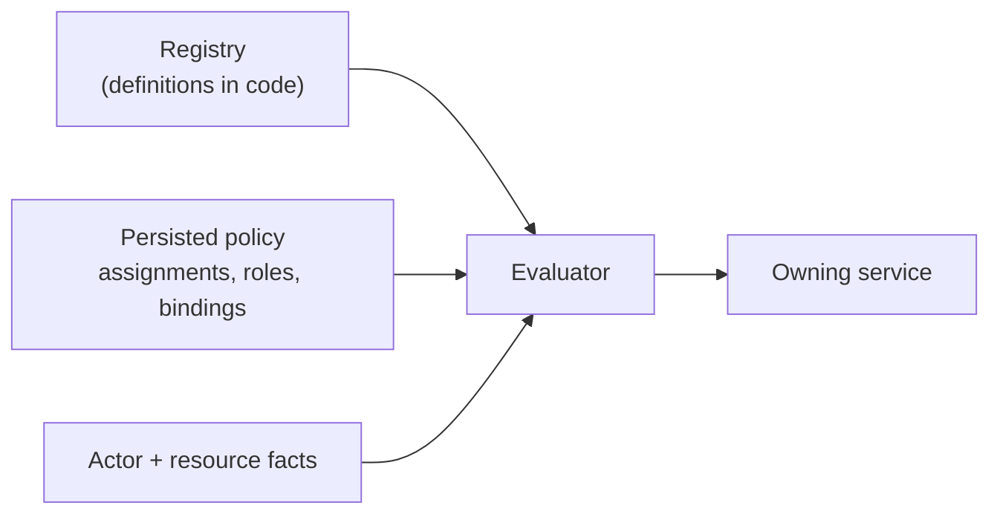

# Permissions

`internal/service/permission` lets Remote decide whether an existing
authenticated user may perform a registered action, supports explicit allow and
deny assignments, groups permissions into custom roles, and lets an authorized
user delegate permissions to someone else. Authorization is decided **inside the
service that owns the protected operation**, never in an HTTP handler.

This guide explains how to:

- declare a permission and register it;
- enforce it in a service method;
- choose a scope and a compatibility baseline;
- test allow, deny, administrator, and system behavior;
- keep persisted keys stable and rename one safely; and
- supply the actor to code that runs outside a request.

## What it is and is not

The layer adds vocabulary and policy on top of identities that already exist. It
does **not** create users, replace the `admin` / `member` roles, or replace
project membership.

| Concern | Owner |
| --- | --- |
| Who exists, and who is an administrator | `service/user`, `service/auth` (`auth.Service.IsAdmin`, which includes the local administrator) |
| Which projects a member can see | `service/project` membership list |
| Which registered actions exist | Code: each owning service's `permissions.go` |
| Who is allowed or denied an action | `service/permission` policy, persisted in `permissions.json` |

Administrators are the root policy: they are allowed every registered
permission, and no stored assignment can remove that. Project membership stays
resource visibility. An explicit allow adds a capability; it does not make a
non-member able to see a project, because the handlers' membership check still
runs before the service is reached.



The registry catalogs; it does not store assignments and does not decide access.
Deny precedence, role expansion, delegation, persistence, and audit live in the
evaluator and service.

## Evaluation order

For `Require(ctx, Check{Permission, Scope})`:

1. The context must carry an actor, otherwise `ErrActorRequired` (fail closed).
2. The check must name a registered permission at a scope kind it supports.
3. The explicit system actor is allowed.
4. A human actor who is a current administrator is allowed.
5. A human actor who is not a registered user is denied.
6. Any matching **deny** (direct assignment or a bound role's rule) denies.
7. Otherwise any matching **allow** allows.
8. Otherwise the definition's **baseline** decides.
9. Otherwise deny.

Scope matching is exact: `platform` matches only `platform`, and
`project:<id>` matches only that project. A platform assignment does not
silently apply to every project.

`Require` returns the stable `permission.ErrDenied`. It never says which role or
deny record caused the result; the structured `Decision` is for logs and tests.

## Declare a permission

Each owning service exports its definitions from a small `permissions.go`. The
project service is the reference:
[`service/project/permissions.go`](../../backend/internal/service/project/permissions.go).

```go
const PermissionLifecycleManage permission.Key = "projects.lifecycle.manage"

func PermissionDefinitions() []permission.Definition {
	return []permission.Definition{{
		Key:         PermissionLifecycleManage,
		Description: "Start, stop, restart, and repair the network of a project's container.",
		Scopes:      []permission.ScopeKind{permission.ScopeProject},
		Baseline:    permission.BaselineProjectMember,
		Delegable:   true,
	}}
}
```

Keys are `<bounded-context>.<resource>.<action>`: exactly three lowercase
dot-separated segments. The registry rejects malformed or duplicate keys, empty
descriptions, empty or unknown scope lists, unknown baselines, and a
project-member baseline on anything but a project-only scope. Registration fails
at construction, so a mistake shows up in tests and at startup.

There is deliberately no `CreatePermission` service method, repository method,
DTO, or persisted definition file. Runtime users assign registered keys; only a
developer adds one.

Register the group in the composition root's catalog,
[`permissionDefinitions()`](../../backend/internal/service/permission_composition.go):

```go
return [][]servicepermission.Definition{
	servicepermission.ManagementDefinitions(),
	serviceproject.PermissionDefinitions(),
	yourservice.PermissionDefinitions(), // add here
}
```

## Choose a scope and baseline

Scope kinds are typed: `platform` and `project`. There is no generic attribute
map. When a real service needs another kind, add it to `ScopeKind`, its
validation, and its exact-match tests.

A baseline is the code-owned rule consulted when no assignment matches. It
exists to preserve behavior that predates the permission.

| Baseline | Allows when no assignment matches |
| --- | --- |
| `BaselineNone` (also the default) | nobody but administrators |
| `BaselineAdmin` | administrators only |
| `BaselineProjectMember` | administrators and members of the checked project |
| `BaselineAuthenticated` | any registered user |

Default to `BaselineNone`: a new permission with no compatibility need should
deny until someone is granted it. Mark `Delegable` only if a non-administrator
may hand the permission to others while holding it at the same scope. The two
management permissions are not delegable.

## Enforce it in the service

Inject the narrow port, not the permission service or a store:

```go
type Authorizer interface {
	Require(context.Context, permission.Check) error
}
```

Call it first in the protected method, through one private helper so every entry
point builds the same check, and keep domain validation and invariants after it:

```go
func (s *Service) Stop(ctx context.Context, id ID) (Meta, error) {
	if err := s.require(ctx, PermissionLifecycleManage, id); err != nil {
		return Meta{}, err
	}
	// ... domain logic ...
}
```

The project service's `require` validates the identifier first so a malformed ID
keeps its `ErrInvalidID` meaning, and authorizes before any lookup so a caller
who may not manage a project cannot learn whether it exists.

A service constructed without an authorizer must fail closed. The project
service's default admits only the explicit system actor.

An enforcing service may import the permission vocabulary but not concrete auth,
transport, or stores; an architecture test enforces that (see
[Architecture rules](#architecture-rules)).

### Separating internal callers

A protected public method cannot be called by background work that has no
authenticated actor. Split it instead of weakening it:

- an authorized public method that requires the permission, and
- an unexported operation with the same mechanics, for callers inside the
  package that already act under another permission (`Start` and `start`).

Callers in another package that legitimately do internal work pass an explicit
system context; see [Supplying the actor](#supplying-the-actor).

## Supplying the actor

Handler files do not carry authorization, and service signatures often have no
caller parameter, so the authenticated actor travels in `context.Context`.

- The auth middleware attaches `permission.UserActor(session.Email)` after the
  session and registration checks pass. It always derives the actor from the
  session, never from a body, query, header, or a value already in the context.
- WebSocket upgrades inherit the request context.
- A missing actor is **never** treated as the system. Protected methods return
  `ErrActorRequired`.
- Trusted internal entry points call `permission.ContextWithSystemActor(ctx)`.
  The system flag is unexported, so a request cannot forge it.

Every caller of `ContextWithSystemActor`, `SystemActor`, and `ContextWithActor`
is on an allowlist in
[`architecture_test.go`](../../backend/internal/service/permission/architecture_test.go).
Adding one means editing that list, which puts the new entry point in review.
Today they are: agent runs starting a container, application container
readiness, notification fan-out reading members, user-removal cleanup, and the
permission service's own `RemoveUserPolicy`.

## Custom roles, assignments, and delegation

A role is a persisted bundle of `(permission, effect)` rules. It is independent
of `user.User.Role` and is never written to it. A binding attaches a role to a
user at a concrete scope, and every rule must support that scope's kind, so a
project role cannot become platform-wide.

Two registered permissions gate policy changes:

- `permissions.assignments.manage` (platform scope): create, change, and remove
  direct assignments and role bindings.
- `permissions.roles.manage` (platform scope): create, change, and delete custom
  roles.

Administrators have both through the root policy. A non-administrator can be
given either, but holding one is not an unrestricted route to permissions the
holder lacks:

1. Assigning or removing a direct assignment requires `assignments.manage`.
2. A non-administrator may only assign a permission that is `Delegable` **and**
   that they currently hold at the same scope. This applies to deny as well.
3. A non-administrator may bind a role only if they could delegate every rule in
   it at the binding scope.
4. A non-administrator may not write a role containing a management permission
   they do not hold.
5. Editing a role changes everyone it is bound to, so a non-administrator may
   edit a bound role only if they could delegate every old and new rule at each
   existing binding's scope. Deleting a bound role requires the explicit
   unbind option and the same check.
6. Every rule is checked against the snapshot held under the store's lock, so a
   concurrent revocation cannot pass a stale check.
7. The target must already exist in the user directory.

Mutations are idempotent where practical: setting the same effect, binding the
same triple, and removing something absent are no-ops that write nothing and
audit nothing.

The same service is what a later transport should call. That handler work must
stay mechanical: authenticate, decode, call the permission service, map errors.

## Persistence and audit

| File | Purpose |
| --- | --- |
| `DATA_DIR/permissions.json` | Schema-versioned policy: assignments, roles, bindings. Mode `0600`, written to a temp file, `fsync`ed, then atomically renamed. |
| `DATA_DIR/permission-audit.jsonl` | Append-only record of every successful mutation: actor, operation, target, permission or role, scope, old and new effect, timestamp. Mode `0600`. |

The audit line is appended before the new state is published, and a failed
append fails the mutation, because an unaudited authorization change is worse
than a rejected one. Audit lines never contain session cookies or unrelated user
data.

At startup the whole file is parsed and validated. Corruption, duplicate IDs,
malformed scopes or effects, bindings to unknown roles, and references to
**unregistered permission keys** stop startup with an actionable error rather
than being discarded, since silently dropping a deny would weaken access. An
absent file is an empty policy, and baselines preserve existing behavior, so no
data migration is needed.

Removing a user deletes their direct assignments and role bindings (role
definitions stay) as part of the existing user-removal cleanup, idempotently.

## Key stability and renames

A key is a persisted identifier. Renaming or removing a registered key while
`permissions.json` still names it makes the next startup fail with an error that
names the key. To rename safely, in one release:

1. Register the new key.
2. Migrate stored records from the old key to the new one (a store migration), or
   keep the old key registered as a temporary alias until the migration ships.
3. Only then remove the old definition.

Never remove a definition while any installation may still hold policy for it.

## Testing recipe

Cover these four behaviors for each protected entry point. The project service
tests in
[`service/project/permissions_test.go`](../../backend/internal/service/project/permissions_test.go)
are the model, and
[`project_membership_routes_test.go`](../../backend/internal/transport/http/handlers/project_membership_routes_test.go)
runs the same paths through the real middleware, evaluator, and file store.

- **Allow**: a caller the baseline or an assignment admits succeeds. With an
  empty policy store, existing behavior is unchanged.
- **Deny**: an explicit deny makes the call fail with `permission.ErrDenied`
  before any side effect, and a direct service call gets the same answer as the
  HTTP route.
- **Administrator**: an administrator still passes despite a deny assignment.
- **System and no actor**: no actor returns `permission.ErrActorRequired`; the
  explicit system context passes only at the reviewed entry points.

To attach an actor in a test:

```go
ctx := permission.ContextWithActor(context.Background(), permission.UserActor("member@example.com"))
```

A test that exercises behavior other than authorization can inject an
allow-all `Authorizer` (see `allowAllAuthorizer` in the project package tests)
instead of building a policy.

## Architecture rules

[`architecture_test.go`](../../backend/internal/service/permission/architecture_test.go)
asserts that:

- the permission package does not import auth, user, project, chat, stores, or
  transport, so it consults only its own ports;
- any service that imports the permission package does not import concrete
  auth, transport, or stores;
- only the allowlisted files construct a system actor or attach an actor to a
  context; and
- nothing in the permission or store packages creates a permission definition
  at runtime.

## Known limitations

- **HTTP status mapping.** Handlers were not changed, and none maps
  `permission.ErrDenied`, so a service-level denial currently surfaces as a
  generic `500` with the body `{"error":"permission denied"}` instead of `403`.
  A later handler task should map it; it is mechanical.
- **Handler-level admin gates still apply.** Routes whose handler rejects
  non-administrators before calling the service (global applications, usage
  prices and rebuild, self-update, Google OAuth configuration, project deletion,
  and project container limits) cannot be opened to a delegated non-administrator
  by a service permission alone.
- **No management API yet.** Roles, assignments, and bindings are available as
  application-service methods (`Services.Permissions`) but are not exposed
  through a route or the web UI.
- **Two protected permissions.** Only `projects.lifecycle.manage` and
  `projects.access.manage` are enforced so far. Low-level `Get` is not protected
  because other services use it as an internal lookup. Container start through
  other paths (agent runs, the agent browser, and installed applications) acts
  under its own capability rather than the lifecycle permission, so a member
  denied `projects.lifecycle.manage` can still cause a start by prompting an
  agent or opening the agent browser. The terminal socket starts a stopped
  container with the member's own context, so a denied member is refused there.
- **Project existence is not validated** when assigning at `project:<id>`; an
  assignment for a deleted project is inert.
