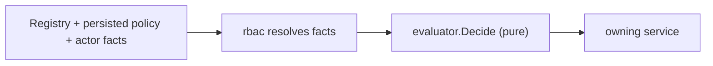

# Permissions

`internal/rbac` decides whether an existing authenticated user may perform a
registered action. Authorization happens **inside the service that owns the
operation**, never in an HTTP handler. Administrators are the root policy: they
are allowed everything, and no stored record can remove that.

## Vocabulary

| Term | Meaning |
| --- | --- |
| **Actor** | Who is acting: a human identified by normalized email, or the trusted system. Carried in `context.Context`; a missing actor is never the system. |
| **Resource / scope** | What the action applies to: `platform` or `project:<id>`. Matching is exact, so a platform record never applies to a project, and project A never applies to project B. |
| **Definition** | A permission declared in code: key `<context>.<resource>.<action>`, supported scope kinds, a baseline, and whether it is delegable. There is no runtime way to create one. |
| **Role** | A persisted bundle of `(permission, effect)` rules. Independent of `user.User.Role`. |
| **Assignment** | A direct `allow` or `deny` of one permission to one user at one scope. |
| **Binding** | Attaches a role to a user at a scope. Every rule in the role must support that scope kind. |
| **Baseline** | The code-owned rule used when nothing matches (`none`, `admin`, `project-member`, `authenticated`). It preserves access that predates the permission. |

## Data model

```go
// Actor: the principal making the request.   (actor.go)
Actor{Email string, system bool}

// Scope: what the action applies to.         (models/definition.go)
Scope{Kind ScopeKind, ID string}

// Definition: a registered permission (code-only).   (models/definition.go)
Definition{Key, Description, Scopes []ScopeKind, Baseline, Delegable bool}

// Role: a reusable bundle of rules — a template, not a user record.  (models/state.go)
Role{ID, Name, Description, Rules []{Permission, Effect}}  // plus bookkeeping fields

// Assignment: one direct allow or deny.   (models/state.go)
Assignment{UserEmail, Permission, Scope, Effect}           // plus bookkeeping fields

// RoleBinding: attaches a role to a user at a scope.   (models/state.go)
RoleBinding{UserEmail, RoleID, Scope}                      // plus bookkeeping fields
```

A **Role** is a template; what a user holds comes from their **Bindings** and **Assignments**.

## Layout

```
rbac/models      vocabulary and persisted records; imports no RBAC package
rbac/evaluator   pure Decide(definition, policy, facts, check); imports only models
rbac             registry, ports, orchestration, mutations, audit; facade in models.go
stores/filepermissions   permissions.json + audit log, depends on rbac contracts only
cmd/remote/main.go       the only place that knows every concrete type
```

`Decide` does no I/O. `rbac` resolves the facts first (actor, administrator,
registered, and project membership when the decision needs it) from the
`IdentityDirectory` and `ProjectMembership` ports, loads the current policy on
every check (no caching), then calls `Decide`.


```mermaid
flowchart LR
    A["Registry + persisted policy + actor facts"] --> B["rbac resolves facts"]
    B --> C["evaluator.Decide (pure)"]
    C --> D["owning service"]
```

## Evaluation order

1. No actor: `ErrActorRequired`. Unregistered permission or unsupported scope:
   an error. Anything that cannot be resolved fails closed.
2. System actor: allow.
3. Administrator: allow.
4. Not a registered user: deny.
5. Any matching **deny** (assignment or bound role rule): deny.
6. Any matching **allow**: allow.
7. The definition's baseline.
8. Default deny.

`Require` returns the stable `ErrDenied` and never says which record decided.
The structured `Decision` is for logs and tests.

## Add a permission

1. Declare it in the owning service's `permissions.go`
   ([example](../../backend/internal/service/project/permissions.go)). Default to
   `BaselineNone`; mark `Delegable` only if a holder may hand it on.
2. Add the group to `permissionDefinitions()` in
   [`cmd/remote/main.go`](../../backend/cmd/remote/main.go).
3. Enforce it. The service takes the narrow `Authorizer` port and binds the
   permission once in its constructor, after options are applied:

   ```go
   service.requireLifecycle = bind(service.authorizer, PermissionLifecycleManage)
   // ...
   if err := s.requireLifecycle(ctx, id); err != nil { return Meta{}, err }
   ```

   Authorize first, before any lookup. A service built without an authorizer
   must fail closed (the project default admits only the system actor).

Renaming a key needs a stored-record migration first.

## Supplying the actor

- The auth middleware attaches `UserActor(session.Email)` from the session only.
- Trusted internal work calls `ContextWithSystemActor(ctx)`.
- Every caller of `ContextWithSystemActor`, `SystemActor`, and `ContextWithActor`
  is allowlisted in
  [`architecture_test.go`](../../backend/internal/rbac/architecture_test.go);
  adding one puts it in review.

## Testing

See [`permissions_test.go`](../../backend/internal/service/project/permissions_test.go)
and [`project_membership_routes_test.go`](../../backend/internal/transport/http/handlers/project_membership_routes_test.go)
for working examples. Attach an actor with:

```go
ctx := permission.ContextWithActor(context.Background(), permission.UserActor("member@example.com"))
```

- **allow**: inject `allowAllAuthorizer{}` for tests not about authorization.
- **deny**: inject `&recordingAuthorizer{err: permission.ErrDenied}` to verify denial and that no side effect runs.
- **administrator**: pass `permission.ContextWithSystemActor(ctx)` — the system actor is always allowed.
- **system and no actor**: a service without an injected authorizer admits only the system actor; an anonymous context returns `ErrActorRequired`.

Tests not about authorization can inject an allow-all Authorizer and ignore the permission path entirely.

## Delegation

`permissions.assignments.manage` and `permissions.roles.manage` (platform scope,
not delegable) gate policy changes. A non-administrator holding one may only
assign or bind what is `Delegable` **and** held by them at the same scope, and
checks run against the snapshot held under the store lock. Targets must exist
in the user directory. Idempotent mutations write and audit nothing.

## Composition and persistence

`main.go` builds auth, the adapters, then RBAC, then calls `service.New` with
both injected. Auth reads users through a view without removal cleanup (cleanup
needs the project service, which needs authorization, which needs auth);
`service.New` builds the user service that keeps cleanup.

`DATA_DIR/permissions.json` (schema-versioned, atomic writes) holds the policy;
`permission-audit.jsonl` records every mutation before it is published. At
startup an absent file is an empty policy; corruption or an unregistered key
refuses to start. Removing a user deletes their assignments and bindings.

## Architecture rules

[`architecture_test.go`](../../backend/internal/rbac/architecture_test.go)
asserts that models import no RBAC parent, the evaluator imports only models,
`filepermissions` imports only rbac contracts, the permission domain does not
import auth, user, project, chat, stores, or transport, enforcing services do
not import concrete auth, transport, or stores, only allowlisted files mint
actors, and nothing creates a permission definition at runtime.

## Known limitations

- Permission denials on chat/project and policy-management routes return `403`.
- Handler-level admin gates still apply ahead of the service.
- Settings → Users → Permissions and the authenticated API use `Services.Permissions`.
- Creation, `projects.lifecycle.manage` and `projects.access.manage` are enforced.
  Agent runs, the agent browser, and installed applications start containers
  under their own capability.
- Project existence is not validated when assigning at `project:<id>`.

## Policy administration and creation controls

Settings → Users → Permissions exposes the existing policy service. A user
needs `permissions.assignments.manage` or `permissions.roles.manage` to read
policy. Each mutation still checks its own management permission and the
existing delegation rules under the store lock. The UI does not replace those
checks. Administrators remain the recovery path and cannot be denied access.

Creation permissions are checked in the owning services before writes or
provisioning:

| Permission | Scope | Empty-policy baseline |
| --- | --- | --- |
| `projects.project.create` | platform | registered users |
| `chats.host.create` | platform | registered users |
| `chats.project.create` | project | project members |

Forking a chat requires the same creation permission as creating one in that
scope. Existing chat access checks still apply. Denying creation does not deny
use of existing chats, agent execution, IDE access or terminal access. Those
capabilities require separate permissions. Project lifecycle and member-list
permissions from the foundation remain enforced. Permission denials on chat
and project routes now return HTTP 403.

To restrict a member from creating projects, select their registered email,
Server scope, Create a project, and Deny. To restrict project chats, select the
specific project and Create or fork a project chat. Platform rules do not
cascade into projects. Create a role containing rules for one scope kind, then
bind it to each user at the intended scope. A bound role must be unbound before
deletion; editing it updates its existing bindings. Removing a rule restores
the code-owned baseline unless another matching rule applies.

Authenticated endpoints:

- `GET /api/permissions`: authorized policy snapshot and code-owned definitions.
- `GET /api/permissions/effective[?projectId=<id>]`: current actor's decisions
  only; no other-user query and no policy records. Used for UI affordances.
- `PUT/DELETE /api/permissions/assignments`: set/remove a direct rule.
- `POST /api/permissions/roles`, `PUT/DELETE /api/permissions/roles/<id>`:
  create/edit/delete roles.
- `PUT/DELETE /api/permissions/bindings`: bind/unbind a role.

Inputs use the existing RBAC field names (`UserEmail`, `Permission`, `Effect`,
`Scope`, `RoleID`, `Name`, `Description`, `Rules`). Scope is
`{"kind":"platform"}` or `{"kind":"project","id":"..."}`. Actor identity always
comes from authenticated middleware. Unknown fields, extra JSON values and
oversized bodies are rejected. Mutation audit and persistence are unchanged.
Creation controls refresh on focus, local policy changes and periodically;
server authorization runs on every operation regardless of UI freshness.

## IDE access

`workspace.ide.open` is a project-scoped, delegable permission with the
project-member baseline. Assign a Deny or bind a denying role to restrict the
built-in IDE. `workspace.hostide.open` separately gates open-file requests from
host chats at platform scope (registered-user baseline).

Both the IDE open-file service and the authenticated edge verifier use the
same current policy. The edge checks project membership as well as permission.
It covers `code.<host>/<slug>/`, `<slug>.code.<host>` and preview URLs for the
reserved IDE listeners (8842 and 8081). Public preview shares cannot authorize
these IDE requests. The launcher shell and API keep their existing session and
API authorization. A policy error or missing authorizer fails closed.

Forward-auth does not pass through API middleware; its reviewed actor-creation
entry point validates the session and registration before attaching the actor.
Forwarded username headers are never identity inputs. The chat header hides
its IDE button when permission is unavailable or denied. Saved links and
open-file links still receive server-side enforcement.

Revocation blocks subsequent HTTP requests and WebSocket handshakes using the
same existing login session. It does not forcibly disconnect an already-open
IDE WebSocket. This controls Remote's built-in IDE entry points, not arbitrary
software installed by a user with authorized shell or agent execution. An IDE
itself can expose terminal and filesystem access; these are not independent
sandbox boundaries.
